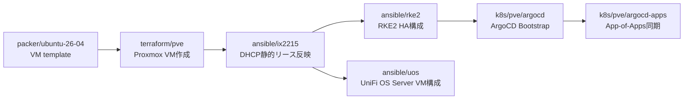
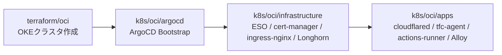
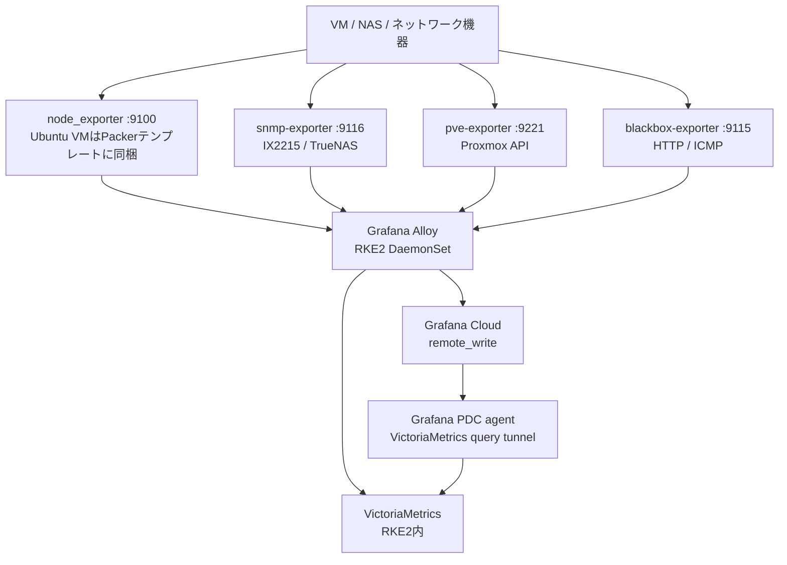

# my-infra

自宅ホームラボ + クラウドサービス等、インフラ全体を管理するリポジトリ。

## アーキテクチャ概要

```mermaid
%%{init: {'themeVariables': {'lineColor': '#000000'}}}%%
flowchart LR
  subgraph Infrastructure[ ]
  direction LR
  subgraph OCI[OCI / Always Free]
  OCI_API{{OCI API}}
    subgraph OKE[OKE Basic cluster - 2x A1.Flex ARM64, ArgoCD GitOps]
      ArgoCD_OCI{{ArgoCD}}
      OCICloudflared([cloudflared])
      OCITFCAgent([tfc-agent])
      OCIESO([external-secrets<br/>Bitwarden BSM])
      OCICert([cert-manager])
      OCIIngress([ingress-nginx])
      OCILonghorn([Longhorn])
      OCIActionsRunner([GitHub Actions Runner])
      OCIAlloy([Grafana Alloy])
      OCIEnc([OCI Encord Server])
      OCILonghorn ~~~ OCIESO ~~~ OCICert ~~~ OCIIngress ~~~ OCIAlloy
      OCICloudflared ~~~ OCIEnc ~~~ ArgoCD_OCI ~~~ OCIActionsRunner ~~~ OCITFCAgent
    end
  end


  subgraph ExtSvc[External Services]
    subgraph Cloudflare[Cloudflare]
      direction LR
      CF_DNS[(DNS)]
      CF_Application[/Application/]
      CF_Tunnel([Tunnel])
    end
    TFC([Terraform Cloud])
    TailscaleNet((Tailscale))
    subgraph Grafana[Grafana Cloud]
      GC_Grafana([Managed Grafana])
      GC_Prometheus[(Managed Prometheus)]
      GC_Grafana ~~~ GC_Prometheus
    end
    GitHub([GitHub])
    Cloudflare ~~~ TFC ~~~ GitHub ~~~ Grafana ~~~ TailscaleNet
  end

  subgraph Home[宅内]
    direction LR
    subgraph NW[NW]
      direction LR
      IX((NEC IX2215 Router<br/>main: v6プラス<br/>guest: 公開AFTR))
      US8[/Ubiquiti US-8-60W L2 SW<br/>192.168.0.252/]
      AP([FS.com AP])
      IX --- US8 --- AP
    end

    subgraph PVE[Proxmox VE Cluster - 2 PVE nodes]
      direction TB
      PVE_API{{PVE API}}

      MM2[[Magic Mirror²]]
      NAS[[TrueNAS Scale VMs<br/>192.168.20.191-192]]
      UOS[[UniFi OS Server VM<br/>192.168.0.132:11443]]

      subgraph WorkEnv[Work station / Build]
        direction LR
        WorkWin[[Windows work station]]
        BuildSV[[Build Server]]
        WorkWin ~~~ BuildSV
      end

      subgraph RKE2VM[RKE2 HA Cluster VM]
        direction LR
        LBVMs[[2x LB VMs<br/>HAProxy + Keepalived<br/>VIP 192.168.20.227]]
        ServerVMs[[3x Server VMs<br/>RKE2 server / etcd<br/>192.168.20.126-128]]
        WorkerVMs[[2x Worker VMs<br/>RKE2 agent<br/>192.168.20.129-130]]
        LBVMs ~~~ ServerVMs ~~~ WorkerVMs
      end
      NAS ~~~ WorkEnv ~~~ MM2 ~~~ RKE2VM ~~~ UOS
    end
    subgraph RKE2[RKE2 HA cluster]
      ArgoCD{{ArgoCD <br/>Sync}}
      subgraph Argo[ArgoCD App-of-Apps]
        subgraph RKE2_agents[SaaS / OSS agents]
          CFPod([cloudflared])
          TFCAgent([tfc-agent])
          Tailscale((Tailscale subnet router<br/> for Emergency Access))
          Alloy([Grafana Alloy])
          PDC([PDC agent])
          CFPod ~~~ PDC ~~~ TFCAgent ~~~ Alloy ~~~ Tailscale 
        end
        subgraph RKE2_system[RKE2 system]
          ESO([external-secrets<br/>Bitwarden BSM])
          MetalLB([MetalLB])
        end
        subgraph Exporters[exporters]
          blackboxEx([Blackbox exporter])
          speedtestEx([Speedtest exporter])
          pveEx([ProxmoxVE exporter])
          snmpEx([SNMP exporter])
          blackboxEx ~~~  speedtestEx ~~~ pveEx ~~~ snmpEx
        end
        subgraph Argo_Apps[Argo Apps]
          VMetrics([VictoriaMetrics])
          CoreDNS([CoreDNS])
          WoL([WoL])
          Mirakurun([Mirakurun])
          EPGStation([EPGStation])
          CoreDNS ~~~ WoL ~~~ VMetrics ~~~ Mirakurun ~~~ EPGStation
        end
        RKE2_agents ~~~ RKE2_system ~~~ Exporters ~~~ Argo_Apps
      end
      Argo ~~~ ArgoCD
    end
     RKE2VM === |Runs on …| RKE2
  end

  OCI ~~~ ExtSvc ~~~ Home

  ArgoCD_OCI -->|sync| GitHub
  GitHub -->|API Request| OCI_API
  ArgoCD -->|sync| GitHub  <-.->|tunnel| OCIActionsRunner
  ArgoCD --> |apply|Argo

  CF_Tunnel -.->|tunnel| CFPod
  CF_Tunnel -.->|tunnel| OCICloudflared

  TailscaleNet <--> Internet
  IX --> Internet

  UOS --->|management| US8

  LBVMs --> ServerVMs --> WorkerVMs

  EPGStation --> Mirakurun
  EPGStation -->|read / ts save| NAS
  EPGStation -->|encode request| OCIEnc -->|save| NAS
  Tailscale <-.-> |tunnel| TailscaleNet
  OCITFCAgent <-.->|tunnel| TFC
  OCIAlloy -->|remote_write| GC_Prometheus
  TFC <-.->|tunnel| TFCAgent -->|API request| PVE_API
  Alloy -->|remote_write| GC_Prometheus
  pveEx -->|API Request| PVE
  snmpEx -->|SNMP| IX
  GC_Grafana <-.->|tunnel| PDC -->|query| VMetrics -->|polling| Exporters
  end

  classDef control fill:#ede9fe,stroke:#7c3aed,color:#2e1065,stroke-width:2px
  classDef cloud fill:#e0f2fe,stroke:#0284c7,color:#082f49,stroke-width:2px
  classDef nwDevice fill:#dcfce7,stroke:#16a34a,color:#052e16,stroke-width:2px
  classDef vm fill:#fef3c7,stroke:#d97706,color:#451a03,stroke-width:2px
  classDef storage fill:#fee2e2,stroke:#dc2626,color:#450a0a,stroke-width:2px
  classDef observability fill:#fce7f3,stroke:#db2777,color:#500724,stroke-width:2px
  classDef external fill:#f1f5f9,stroke:#475569,color:#0f172a,stroke-width:2px
  classDef zoneCloud fill:#eff6ff,stroke:#2563eb,color:#172554,stroke-width:2px
  classDef zoneExternal fill:#f8fafc,stroke:#64748b,color:#0f172a,stroke-width:2px
  classDef zoneHome fill:#f0fdf4,stroke:#22c55e,color:#052e16,stroke-width:2px
  classDef zoneNetwork fill:#ecfdf5,stroke:#10b981,color:#064e3b,stroke-width:2px
  classDef zoneVirtual fill:#fffbeb,stroke:#f59e0b,color:#451a03,stroke-width:2px
  classDef zoneK8s fill:#f5f3ff,stroke:#8b5cf6,color:#2e1065,stroke-width:2px
  classDef zoneApps fill:#fdf2f8,stroke:#ec4899,color:#500724,stroke-width:2px

  class ArgoCD_OCI,ArgoCD,OCICert,MetalLB control
  class OCICloudflared,OCITFCAgent,OCIIngress,OCIActionsRunner,CFPod,TFCAgent,Tailscale,PDC cloud
  class IX,US8,AP,TailscaleNet nwDevice
  class MM2,NAS,BuildSV,WorkWin,UOS,LBVMs,ServerVMs,WorkerVMs vm
  class OCIESO,OCILonghorn,ESO,VMetrics,Mirakurun,EPGStation,WoL,CoreDNS,CF_DNS,GC_Prometheus storage
  class OCIAlloy,Alloy,blackboxEx,speedtestEx,pveEx,snmpEx,GC_Grafana observability
  class CF_Application,CF_Tunnel,TFC,GitHub external
  class OCI,OKE zoneCloud
  class ExtSvc,Cloudflare,Grafana zoneExternal
  class Home zoneHome
  class NW zoneNetwork
  class PVE,WorkEnv zoneVirtual
  class RKE2,RKE2VM,Argo zoneK8s
  class RKE2_agents,RKE2_system,Exporters,Argo_Apps zoneApps

  linkStyle 33 stroke:#7c3aed,stroke-width:4px
```



## ドメイン

- `miutaku.work` — Cloudflare で管理。
- `miutaku.internal` — CoreDNS (RKE2 on MetalLB `192.168.20.201`) で内部名前解決。

## ネットワーク構成

| VLAN | サブネット | 用途 |
|------|-----------|------|
| (native) | 192.168.0.0/24 | |
| VLAN 10 | 192.168.10.0/24 | 管理 (PVE / RPi / nanokvm / スイッチ / AP) |
| VLAN 20 | 192.168.20.0/24 | サーバ (RKE2 / NAS / MetalLB pool: 192.168.20.200 - .192.168.20.226) |
| VLAN 30 | 192.168.30.0/24 | クライアント (PC / ゲーム機) |
| VLAN 31 | 192.168.31.0/24 | 来客用 / 他VLANにアクセス不可 / 公開AFTR を用いたインターネット接続 |
| VLAN 40 | 192.168.40.0/24 | IoT / スマートホーム |

## シークレット管理

すべてのシークレットは **Bitwarden Secrets Manager (BSM)** で管理する。  
k8s への注入は **External Secrets Operator (ESO)** + bitwarden-sdk-server 経由。  
Ansible は `bws` CLI + `BWS_ACCESS_TOKEN` 環境変数で取得する。

## リポジトリ構成

```
my-infra/
├── terraform/
│   ├── oci/            OCI OKE クラスタ (TFC workspace: my-infra)
│   ├── pve/            Proxmox VM 全台 (TFC workspace: pve-home)
│   └── cloudflare/     Cloudflare DNS / Tunnel / Zero Trust Access (TFC workspace: cloudflare)
├── ansible/
│   ├── rke2/           RKE2 クラスタ構成 (HAProxy + Keepalived + RKE2)
│   ├── ix2215/         IX2215 VLAN・DHCP 静的リース管理
│   ├── uos/            UniFi OS Server 専用 VM 構成
│   ├── monitoring/     既存 VM 向け node_exporter 補助 playbook
│   └── pbs/            Proxmox Backup Server 構築
├── k8s/
│   ├── pve/            宅内 RKE2 (ArgoCD App-of-Apps)
│   └── oci/            OCI OKE (ArgoCD GitOps)
└── packer/
    ├── ubuntu-26-04/   Proxmox テンプレート (Ubuntu 26.04 LTS)
    └── truenas-scale/  Proxmox テンプレート (TrueNAS Scale)
```

## 作業フロー: 宅内クラスタを新規構築する順序



## 作業フロー: OKE クラスタを新規構築する順序



## kubectl 操作環境

2 つの k8s クラスタを管理するために、kubeconfig を統合して使う。

### コンテキスト一覧

| コンテキスト名 | クラスタ | 接続先 |
|---|---|---|
| `rke2-pve` | 宅内 RKE2 (Proxmox) | LB VIP `192.168.20.227:6443` |
| `oke-cloud` | OCI OKE | 以下のセットアップ手順で設定すると構成される |

### セットアップ手順 (新規マシン)

セットアップ用スクリプトを `scripts/` に用意している。

**Step 1: ツール一式をインストール**

`BWS_ACCESS_TOKEN` は BSMから取得しておく。

```bash
echo 'export BWS_ACCESS_TOKEN="<ACCESS_TOKEN>"' >> ~/.bashrc
bash scripts/setup-k8s-tools
source ~/.bashrc
```

インストールされるもの: `kubectl`, `kubectx`, `kubens`, `oci` (OCI CLI), `bws` (Bitwarden SM CLI)  
OCI 認証情報 (`~/.oci/config`, `~/.oci/oci_api_key.pem`) は BSM の `OCI_*` シークレットから自動生成される。

**Step 2: kubeconfig を取得・統合**

```bash
bash scripts/setup-kubeconfig   # RKE2 + OKE 両方取得して ~/.kube/config に統合
# 個別に設定も可能:
bash scripts/setup-kubeconfig --rke2-only
bash scripts/setup-kubeconfig --oke-only
```

> **RKE2 の注意点**
> - `/etc/rancher/rke2/rke2.yaml` は root 所有のため、スクリプトでは `sudo cat` 経由で取得される
> - kubeconfig 内の `server` が `127.0.0.1:6443` になっているため、スクリプトで LB VIP (`192.168.20.227`) に自動書き換え
> - SSH 接続先は `master-01` (IP: `192.168.20.126`)

> **OKE の注意点**
> - kubeconfig の認証に `oci` コマンドを使う exec plugin が埋め込まれる
> - `oci` が PATH 上にある必要があるため `/usr/local/bin/oci -> ~/bin/oci` のシンボリックリンクを作成する

### 日常操作

```bash
kubectx              # コンテキスト一覧
kubectx rke2-pve     # 宅内 RKE2 に切り替え
kubectx oke-cloud    # OCI OKE  に切り替え
kubens               # namespace 一覧
```

---

## 各コンポーネントの README

作業前に必ず該当 README を読むこと。

| コンポーネント | README | 主な内容 |
|---|---|---|
| OCI Terraform | [terraform/oci/README.md](./terraform/oci/README.md) | OKE 構築, TFC Variables |
| PVE Terraform | [terraform/pve/README.md](./terraform/pve/README.md) | VM 作成, MAC/IP 管理, Ansible 自動生成 |
| Cloudflare Terraform | [terraform/cloudflare/README.md](./terraform/cloudflare/README.md) | Tunnel, DNS, Zero Trust |
| RKE2 Ansible | [ansible/rke2/README.md](./ansible/rke2/README.md) | RKE2 HA クラスタ構成 |
| IX2215 Ansible | [ansible/ix2215/README.md](./ansible/ix2215/README.md) | VLAN・DHCP 静的リース |
| UniFi OS Server Ansible | [ansible/uos/README.md](./ansible/uos/README.md) | 専用 VM 上の UniFi OS Server 構成 |
| PBS Ansible | [ansible/pbs/README.md](./ansible/pbs/README.md) | Proxmox Backup Server |
| ArgoCD Bootstrap (RKE2) | [k8s/pve/argocd/README.md](./k8s/pve/argocd/README.md) | BSM シークレット一覧, App-of-Apps |
| ArgoCD Bootstrap (OKE) | [k8s/oci/argocd/README.md](./k8s/oci/argocd/README.md) | BSM シークレット一覧, TLS cert 手順, sync-wave 順序 |
| PDC Agent | [k8s/pve/pdc-agent/README.md](./k8s/pve/pdc-agent/README.md) | Grafana PDC トンネル |
| Packer Ubuntu | [packer/ubuntu-26-04/README.md](./packer/ubuntu-26-04/README.md) | テンプレートビルド |
| Packer TrueNAS | [packer/truenas-scale/README.md](./packer/truenas-scale/README.md) | テンプレートビルド |
| Actions Runner (OKE) | [k8s/oci/apps/actions-runner/README.md](./k8s/oci/apps/actions-runner/README.md) | OKE 上の GitHub runner |

## 監視アーキテクチャ



### メトリクス収集対象

| ホスト / 機器 | IP | 収集方法 | 状態 |
|---|---|---|---|
| IX2215 | 192.168.0.254 | snmp-exporter (IF-MIB) | ✅ |
| IX2215 | 192.168.0.254 | blackbox HTTP/ICMP | ✅ |
| pve-x570 | 192.168.0.115 | pve-exporter | BSM 要設定 |
| pve-b550m | 192.168.0.119 | pve-exporter | BSM 要設定 |
| RKE2 nodes ×5 | 192.168.20.126-130 | Alloy DaemonSet (node) | ✅ |
| UniFi OS Server VM | 192.168.0.132 | node_exporter :9100 + blackbox HTTP/ICMP | ✅ |
| LB ×2 | 192.168.20.135-136 | node_exporter :9100 + blackbox ICMP | ✅ |
| dev-app-server | 192.168.20.101 | node_exporter :9100 | ✅ |
| mm-server-01 (MagicMirror²) | 192.168.40.1 | node_exporter :9100 | ✅ (VLAN40) |
| nas-01/02 (TrueNAS) | 192.168.20.191-192 | node_exporter :9100 | 要手動インストール |
| OKE nodes ×2 | 10.0.1.x | Alloy DaemonSet (node) | ✅ |

### node_exporter について

node_exporter は **Packer テンプレート** (`packer/ubuntu-26-04/`) にベイク済み。  
テンプレートから作成した VM は起動時点で `:9100` で node_exporter が待ち受ける。

既存 VM（テンプレート再ビルド前に作成済み）は、必要に応じて Ansible で一括導入する。

```bash
cd ansible/monitoring
ansible-playbook site.yml
```

### PVE exporter の有効化（BSM シークレット登録後）

Proxmox Web UI で API トークンを発行し BSM に登録:
- `PVE_MONITORING_TOKEN_ID` — 例: `root@pam!monitoring`
- `PVE_MONITORING_TOKEN_SECRET` — トークンシークレット

### Grafana Cloud 推奨ダッシュボード

| ダッシュボード | ID |
|---|---|
| Node Exporter Full | 1860 |
| SNMP Interface Stats | 11169 |
| Proxmox VE | 10347 |
| Blackbox Exporter | 7587 |

---

## 開発環境セットアップ

クローン後に一度だけ実行する:

```bash
git config core.hooksPath .githooks
```

push 前に変更があったディレクトリのみ自動で lint が走る:

| 変更パス | 実行内容 |
|---|---|
| `ansible/ix2215/**` | `pipenv run ansible-lint site.yml` |
| `packer/ubuntu-26-04/**` | `packer validate` |
| `packer/truenas-scale/**` | `packer validate` |

---

## CI / GitHub Actions

| ワークフロー | トリガーパス | 内容 |
|---|---|---|
| `terraform_pve.yml` | `terraform/pve/**` | plan (PR) / apply (main) + Ansible inventory 自動コミット |
| `terraform_oci.yml` | `terraform/oci/**` | plan (PR) / apply (main) |
| `terraform_cloudflare.yml` | `terraform/cloudflare/**` | plan (PR) / apply (main) |
| `ansible_check_rke2.yml` | `ansible/rke2/**` | lint + syntax-check |
| `ansible_check_ix2215.yml` | `ansible/ix2215/**` | lint + syntax-check |
| `packer.yml` | `packer/**` | packer validate (実ビルドは手動) |

## 新しいノードを用意したりIPアドレスを変更する場合

主に以下のファイルを修正し、反映すること。ほかにも必要に応じて修正すること。

```text
ansible/ix2215/group_vars/all.yml
k8s/pve/coredns/Corefile
k8s/pve/grafana-alloy/values.yaml
k8s/pve/wol/appdata/db/computers.txt
```
