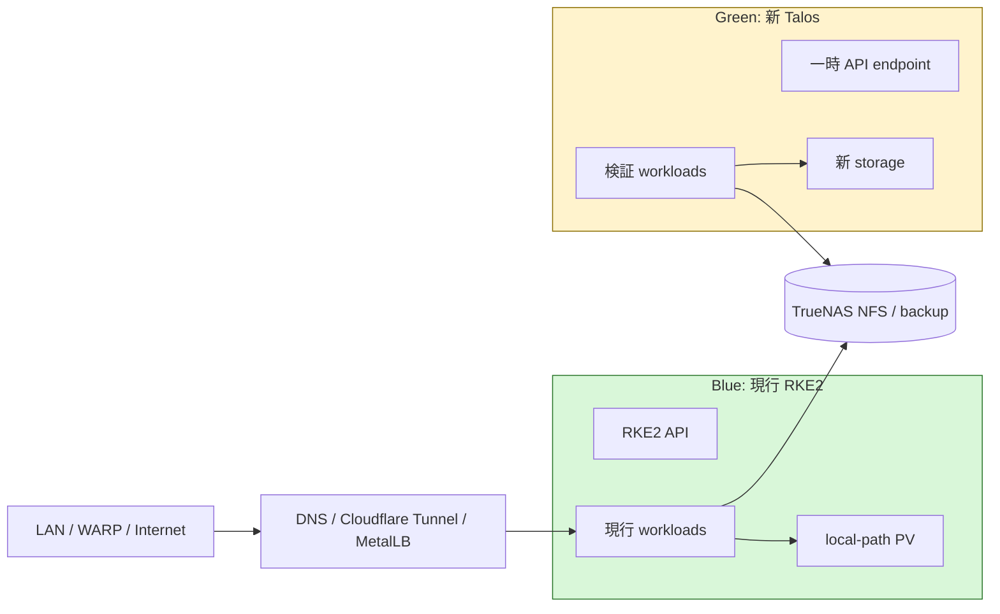

# RKE2 から Talos Linux への移行プロジェクト

## この文書について

この文書は、宅内 Proxmox 上の Ubuntu + RKE2 クラスタを Talos Linux に移行するための
プロジェクト台帳兼ランブックである。設計判断、作業状況、検証結果、移行手順、切り戻し
条件をこのファイルに集約する。

初めて参加する人は、まず「要約」「安全原則」「現在の構成」「フェーズと合格条件」を読むこと。
作業を行った人は、同じ Pull Request でチェックリストと作業記録を更新すること。

| 項目 | 値 |
|---|---|
| ステータス | Gate 0/1/2/4合格。Phase 5のデータ移行準備中。Phase 3のPT3試験は予約条件待ち |
| 開始日 | 2026-08-30 |
| 現行クラスタ | `rke2-pve` |
| 移行方式 | 新旧クラスタの並行稼働による Blue/Green 移行 |
| 本番変更 | Green専用VM 5台とDHCP予約を追加。Blueのroute、DNS、Tunnel、workload接続先は未変更 |
| 次の判定ゲート | Gate 5: workload/dataの隔離restoreと整合性確認 |
| 現在のblocker | PT3はstock TalosでdriverなしのためUbuntu外部service化が必要。Green専用BSM accountと修正版MetalLBも未準備 |

## 要約

Talos への移行は可能だが、既存 RKE2 ノードを Talos で上書きするインプレース移行は行わない。
別の Talos クラスタを一時 IP と一時 VM ID で構築し、既存 RKE2 を稼働させたまま検証する。
検証に合格したワークロードから Talos へ移し、最後に公開経路、内部 DNS、Kubernetes API の
接続先を切り替える。

本番GreenはTalos `v1.13.9` / Kubernetes `1.35.7`、3 control plane + 2 workerで構築済みである。
API VIPは`192.168.20.228`で、control plane 1台とworker 1台の個別reboot中もAPI連続到達と
workload復帰を確認した。Argo CDを含む基盤addonはGreenへ直接導入済みだが、root Applicationは
Blueから切り離してあり、利用者通信と本番データはまだBlueを参照している。

通常の Kubernetes ワークロードはほぼ移植可能である。移行前に解決すべき主な課題は次の4点。

1. Earthsoft PT3 と `/dev/dvb` を Talos で利用できるか
2. Loockit が依存するホスト BlueZ と D-Bus をどう置き換えるか
3. 現在ノードローカルにある 6 PV、合計 81 GiB をどう移すか
4. RKE2 同梱の CoreDNS、metrics-server、Canal 相当機能をどう再構成するか

## 目的

- 既存サービスへ予期しない停止や通信先変更を発生させずに Talos の適合性を検証する。
- Kubernetes ノードから Ubuntu、SSH、apt、systemd による日常運用依存をなくす。
- OS、Kubernetes、ノード設定を宣言的に再構築できる状態にする。
- Argo CD、External Secrets、Cloudflare Tunnel、MetalLB、TrueNAS を継続利用する。
- データ移行と切り戻しを、担当者以外でも実行・確認できる手順にする。

## 対象外

- OKE クラスタの Talos 化
- Proxmox、TrueNAS、IX2215、UniFi OS Server 自体の置き換え
- 移行と同時に行うアプリケーションの大規模バージョンアップ
- Talos 移行に不要な Packer/Ansible 構成の削除

## 用語

| 用語 | 意味 |
|---|---|
| RKE2 | 現在 Ubuntu ノード上で動作している Kubernetes distribution |
| Talos | Kubernetes 専用の API 管理型 Linux。通常の SSH/apt/systemd 運用を行わない |
| Blue | 現在サービスを提供している RKE2 クラスタ |
| Green | 並行構築する Talos クラスタ |
| PoC | 本番切り替え前の機能・互換性検証環境 |
| Gate | 次のフェーズへ進むために全項目を満たす必要がある合格条件 |
| local-path | ノードのローカルディスクを使う StorageClass。別ノードへ自動移動しない |
| NFS PV | TrueNAS 上のデータを NFS 4.1 でマウントする PersistentVolume |

## 安全原則

以下は全フェーズで必須とする。

1. Green の検証中は Blue の VM、ノード、etcd、PV、Service、DNS、Tunnel を変更しない。
2. Green は Blue と異なる VM ID、MAC アドレス、IP、API endpoint を使う。
3. Blue と同じ MetalLB IP を Green で広告しない。
4. Blue と同じ stateful backend へ、Green から書き込みを行わない。
5. `kubectl` 実行時は必ず `--context` を指定する。暗黙の current-context に依存しない。
6. Terraform の `apply`、Argo CD の同期、DNS/Tunnel 切り替えは、各フェーズの Gate 合格後に行う。
7. PT3 PCI device と Bluetooth USB device は同時に2 VMへ割り当てない。例外的なGreen検証は
   利用中でないことを確認し、切り離し前の状態を記録し、試験直後にBlueへ原状復帰する。
8. 削除ではなく、新規作成、停止、名前変更の順で切り戻し可能性を保つ。
9. Secret の値、kubeconfig、talosconfig を Git に保存しない。
10. 実行前後にこの文書の作業記録へ、日時、担当、コマンドの目的、結果を追記する。
11. PoC資源には所有者、作成日、失効日、削除条件を記録し、不要になった時点または本移行完了後に削除する。

### 作業禁止条件

次のいずれかに該当する場合は作業を中止する。

- 対象クラスタ、VM ID、IP、Proxmox node を一意に確認できない。
- Blue のバックアップと復元手順が確認できない。
- Green のIPが未使用であることを確認できない。
- Proxmox の空きCPU、メモリ、ディスクが PoC 要件を満たさない。
- PT3/Bluetooth の検証前に利用状況、排他性、原状復帰手順を確認できない。
- stateful workload の書き込み停止方法と整合性確認方法が決まっていない。

## 移行アーキテクチャ



Green の検証中、利用者向けの経路は Blue のままとする。Green へのアクセスは管理端末からの
一時 endpoint、または本番と重複しない検証用 Service IP のみに限定する。

## 現在の構成

### ノード

2026-08-30 に `kubectl --context rke2-pve get nodes` で確認した実状態。

| 役割 | 台数 | OS / architecture | 主な用途 |
|---|---:|---|---|
| control plane + etcd | 3 | Ubuntu 26.04.1 / amd64 | Kubernetes API、etcd |
| 汎用 worker | 2 | Ubuntu 26.04.1 / amd64 | 通常アプリ、DB、監視、Bluetooth |
| DVB worker | 1 | Ubuntu 26.04.1 / amd64 | PT3 passthrough、Mirakurun |
| Raspberry Pi worker | 2 | Ubuntu 26.04 / arm64 | Bluetooth、低優先度encode候補 |

現行 Kubernetes は `v1.35.7+rke2r1`。Talos 1.13 は Kubernetes 1.35 をサポートするため、
最初の移行では Kubernetes minor version を変えない。

### ネットワーク

| 用途 | 現行値 | Green での扱い |
|---|---|---|
| RKE2 API VIP | `192.168.20.227:6443` | 切り替えまで Blue 専用 |
| RKE2 join | `192.168.20.227:9345` | Talos では不要 |
| MetalLB pool | `192.168.20.200-192.168.20.226` | PoC 用範囲を別途予約するまで Green では無効 |
| 内部 DNS Service | `192.168.20.201` | 切り替えまで Blue 専用 |
| VLAN | server VLAN 20、Pi は management VLAN 10 | Green でもルーティング要件を検証 |
| Cloudflare Tunnel | `rke2-home-managed-by-tf` | PoC では接続しない |

### RKE2 同梱コンポーネント

実クラスタでは次が RKE2 により管理されている。

| コンポーネント | 実利用 | Talos 側の方針 |
|---|---|---|
| Canal | Pod network + NetworkPolicy | Talos Flannel + NetworkPolicyを明示的に有効化。Ciliumは別ADRで判断 |
| CoreDNS | 必須 | Talos標準CoreDNSから開始。worker配置要件を別途検証 |
| metrics-server | HPA 4個が利用 | Argo CD管理で追加 |
| Ingress NGINX | 現在Ingressなし | 初期移行では導入しない |
| snapshot-controller | 現在VolumeSnapshotなし | CSI採用時に再評価 |
| Helm Controller | `rke2-coredns`設定で利用 | 使用しない。標準Kubernetes manifestへ置換 |

### 永続データ

2026-08-30 の実クラスタを正とする。要求容量に加えて、各worker上の実ディレクトリを`du`で
read-only計測した。

#### local-path PV

| namespace / PVC | 要求 | 実使用 | 現在のノード | 現在のbackup | 移行方法（暫定） |
|---|---:|---:|---|---|---|
| `infra-db/data-postgres-0` | 20 GiB | 167 MiB | worker-01 | PBS VM snapshotのみ | PostgreSQL dump/restore |
| `infra-db-staging/data-postgres-0` | 20 GiB | 178 MiB | worker-01 | PBS VM snapshotのみ | PostgreSQL dump/restore、必要なら再作成 |
| `infra-db/data-mariadb-0` | 10 GiB | 266 MiB | worker-01 | 日次OCI S3 logical dump + PBS | MariaDB dump/restore |
| `app-nextcloud/nextcloud-html-pvc` | 10 GiB | 801 MiB | worker-01 | PBS VM snapshotのみ | maintenance mode + rsync/backup restore |
| `monitoring/server-volume-...` | 20 GiB | 458 MiB | worker-01 | PBS VM snapshotのみ | snapshot/copy、または30日履歴の再生成を承認 |
| `app-mirakurun/mirakurun-data` | 1 GiB | 18 MiB | DVB worker | なし | 設定/状態をファイルコピー |

要求容量合計は81 GiB、実使用量合計は約1.84 GiB。worker-01 VM `12001`はPBS snapshot jobに含まれ、
2026-08-30 00:00 JSTのjobでOS disk 96 GiBのbackup成功を確認した。ただし`keep-last=1`であり、DBや
Nextcloud/VictoriaMetricsのアプリ整合restoreを保証しない。MariaDB CronJobは2026-08-29 03:00 JSTに
EPGStation/Nextcloud DBのOCI S3 upload成功を確認した。DVB worker VM `12900`はPBS job対象外で、
MirakurunにはGit外のbackupも見つからない。このためHardware PoC前に`mirakurun-data`を必ず退避する。

OSディスクをTalosで上書きすると失われるため、データ移行完了前に既存workerを再インストールしては
ならない。Gate 4までに全6件のアプリ整合backupを新規取得し、Greenへのrestoreを実証する。

#### NFS PV

TrueNAS `192.168.20.191` / `192.168.20.192` を使う静的 NFS PV は9本存在する。
録画、thumbnail、TNLAStation共有領域、Nextcloud録画参照、ARC cacheが対象。Greenからは
最初にread-only Podでmount試験を行い、書き込み試験は専用のテスト用exportで行う。

### Gitと実クラスタの差分

| 差分 | リスク | 対応 |
|---|---|---|
| ~~`app-epgstation/data-mariadb-0` PVCがGitにない~~ | 解消済み | 参照Pod/Controller/Serviceがないことと、EPGStationが`infra-db`のMariaDBを使用することを確認。2026-08-30にPVC、PV、実データを削除 |
| `rke2-ingress-nginx` HelmChartConfigがGitにない | 再構築時に設定が消える | Ingress未使用を再確認し、移行対象外にする |
| TNLAStation系NFS PV 4本のexportが`ansible/truenas`にない | TrueNAS再構築時にshareが復元されない | live export設定を確認し、既存値をGitへ取り込む |
| PVのnode affinityが旧互換hostnameを利用 | hostname変更でPodが起動しない | Greenでは新PVへデータ移行し、旧PVを再利用しない |

2026-08-30のGit外PVC削除では、PVのnode affinityが旧hostname、実ディレクトリが互換名を持つ
現worker-01にあり、local-path provisionerの削除helperが存在しないnode名を待って停止した。
ノード改名前にlocal-path PVを移行または削除する。改名後に削除する場合は、PVの`hostPath.path`と
実ホストを特定し、実データ消去を確認してから停止したhelperとPVオブジェクトを片付ける。

## Talos 適合性の課題

### PT3 / Mirakurun

Earthsoft PT3 は Proxmox から DVB worker VM へPCI passthroughされている。stock Talos の
公式extension catalogにはPT3専用extensionがないため、次の順で検証する。

1. TNLAStationの録画中件数と予約一覧を確認し、試験時間帯に録画予約がないことを確認する。
2. MirakurunのPod、node、PT3 mappingとProxmox VM設定を原状復帰用に保存する。
3. Mirakurunを停止し、PT3がBlue VMから外れたことを確認してからGreen DVB workerへ割り当てる。
4. PCI device、kernel module、`/dev/dvb/adapter0`を確認する。
5. stock Talosで認識しなければ、Talosと同一kernel向けのcustom module/extensionを試作する。
6. Mirakurunのchannel scan、同時tuning、30分以上の連続受信を確認する。
7. 試験後はGreenを停止してPT3を外し、Blue VMへ再割り当てしてMirakurunを復旧する。
8. TNLAStationのstream、tuner status、次回予約を確認し、復旧時刻を記録する。

現在のPT3はBlueが使用中で、1デバイスを2 VMへ同時割り当てできない。録画予約が存在する場合は
試験しない。予約がない場合も通常PoCと分離し、上記の排他確認と原状復帰を一連の作業として行う。
2026-08-30の確認時点では録画中0件、予約1件（2026-09-05 23:00-23:30 JST）のため、
Hardware PoCは未実施とした。実施直前にも同じAPIを再確認し、過去の結果を流用しない。

### Bluetooth / Loockit

現在のLoockitはUbuntu hostのBlueZと`/run/dbus`を利用する。stock Talosには同等のhost serviceが
ないため、そのままでは起動できない。

検討順序は次のとおり。

1. BlueZをLoockit Podまたはsidecar内で動かし、USB deviceをPodへ直接渡す。
2. Loockitを専用Ubuntu VMへ分離し、Talosから通常のnetwork serviceとして利用する。
3. Talos extension serviceとしてBlueZを独自保守する。

1を第一候補、2を安全なfallbackとする。3はTalos更新ごとにkernel/userspace互換性を保守する
必要があるため、他方式が成立しない場合に限定する。

Bluetooth USB mappingもBlueが使用中である。予備adapterなしに既存mappingをGreenへ移しては
ならない。2026-08-30のProxmox mapping確認では`0a12:0001`がx570/b550mに1個ずつあり、どちらも
worker-01/02へ割当済みだった。PT3も1枚だけでDVB worker VM 12900へ割当済みであり、予備deviceは
ない。現割当と原状復帰手順は`talos/poc/hardware-baseline.md`へ保存した。

### Raspberry Pi 4

Raspberry Pi 4自体はTalos対応対象。次を個別に置き換える。

- `/boot/firmware/config.txt`のWi-Fi/Bluetooth overlay: Talos Image Factory overlay/boot asset
- BlueZ: Loockit方針に従う
- CPU governor/min/maxのsystemd service: Talos machine configのsysfs設定または未設定時の熱試験
- arm64 taint、node label: Talos configまたはcluster-admin管理

Piは本番サービスの必須配置先ではないため、amd64クラスタ移行後の独立フェーズとする。

### Node label / hostname

以下のlabelまたはhostnameをワークロードが参照している。

- `hardware.miutaku/bluetooth=true`
- `loockit.miutaku/receiver=true`
- `hardware.miutaku/dvb=true`
- `hardware.miutaku/pt3=true`
- `topology.miutaku/proxmox-node=<node>`
- `node.miutaku/role=agent`
- `kubernetes.io/hostname`
- TNLAStationのworker名別weight

Talosでcustom labelを設定できるかをmachine config versionごとに確認し、NodeRestrictionで拒否される
labelはbootstrap後にcluster-admin権限の自動処理で設定する。hostnameをRKE2名のまま残すことを
移行要件にはしない。アプリ設定を役割labelへ置き換える。

## Green PoC の設計

### PoC の最小構成

| 項目 | 暫定値 |
|---|---|
| control plane | 1 VM、2 vCPU、4 GiB RAM、32 GiB OS disk、`pve-x570`候補 |
| worker | 1 VM、4 vCPU、6 GiB RAM、32 GiB OS + 16 GiB data disk、`pve-b550m`候補 |
| Talos | `v1.13.9`、適用前にImage Factory installerをdigest固定 |
| Kubernetes | 1.35系に固定 |
| CNI | Talos Flannel、NetworkPolicy有効 |
| storage | Talos UserVolume + `/var/mnt/local-path-provisioner`の試験用領域 |
| API endpoint | `https://192.168.20.137:6443`（単一control plane） |
| LoadBalancer | 初期は無効。後半で本番と重複しない一時poolを使用 |
| QEMU agent | 基本PoCはvanilla imageで無効。custom schematic試験時だけ有効化 |

3 control planeのHA検証は最小PoC合格後に行う。Proxmoxの空きリソースを確認する前にVMを作成しない。

2026-08-30のread-only確認では、`pve-x570`はRAM約12.5 GiB、local-zfs約152 GiB、
`pve-b550m`はRAM約20.6 GiB、local-zfs約226 GiBがavailableだった。上記の分散配置なら
最小PoCのRAM 10 GiB、disk 80 GiBを収容できる。VM ID `13001`、`13002`は同日時点で未使用だが、
Terraformコード上でPoC専用に割り当てた。作成直前にもクラスタ全体で再確認する。

PoC時の予約値は次のとおり。検証後にVMとISOを削除し、同じidentityの`.137/.138`は本番Greenへ
再利用した。`.228`はBlue MetalLB pool `.200-.226`とRKE2 VIP `.227`の外に置き、本番Greenの
Talos API VIPへ昇格した。PoCの再現確認は`talos/poc/scripts/preflight-reservations`を使う。

| 用途 | VM ID | MAC | IP |
|---|---:|---|---|
| PoC control plane / API | 13001 | `02:54:00:13:00:01` | `192.168.20.137` |
| PoC worker | 13002 | `02:54:00:13:00:02` | `192.168.20.138` |
| PoC MetalLB test | - | - | `192.168.20.228` |

### PoCのsecret分離

- Talos PKI、machine config、talosconfigは`talos/poc/.generated`だけに生成し、Gitへ保存しない。
- PoC終了時に一時PKIとlocal stateを削除する。本番移行用PKIとは再利用しない。
- External SecretsはPoC専用BSM project/Machine Accountを使い、Blueのbootstrap tokenをコピーしない。
- PoC secret keyは`TALOS_POC_`prefixとし、本番ExternalSecretから参照できない権限に限定する。
- Proxmox API tokenは既存BSM経由だけを使う。rootの広権限一時tokenを自動生成しない。

`BWS_ACCESS_TOKEN`は2026-08-30に再発行して認証復旧済み。live Terraform planは4 add、0 change、
0 destroyで、Talos ISO 2個と停止VM 2台だけが対象であることを機械確認して適用した。rootの一時tokenは
使っていない。IX2215のdry-runも固定lease 2件だけであることを確認してから適用済み。

### PoC で禁止するもの

- production Cloudflare Tunnel token
- `192.168.20.227` API VIP
- `192.168.20.201` DNS VIP
- 現行MetalLB poolから未確認のIPを割り当てること
- production DB、Nextcloud、VictoriaMetricsへの書き込み
- BlueのExternalSecret provider tokenのコピー
- Blueのetcd snapshotをGreenへrestoreすること

### PoC資源台帳と削除ルール

PoCで作るVM、disk、ISO、IP予約、DHCP lease、DNS、MetalLB IP、credential、NFS test dataは、
作成前に次の台帳へ1行追加する。`削除証跡`が埋まるまで作業完了としない。

| 資源 | 所有者 | 作成日 | 失効日 | 削除条件 | 状態 | 削除証跡 |
|---|---|---|---|---|---|---|
| 基本PoC一式（VM 13001/13002、disk、ISO 2個、DHCP lease 2件） | my-infra | 2026-08-30 | 2026-08-31 | Gate 1不合格、不要判断、または本移行完了 | 削除済み。ID/MAC/IPは本番Greenへ再利用 | Terraform destroy 4件、旧PoC PKI/state/cache/local設定も削除 |
| POC-06 NFS write dataset/share | my-infra | 2026-08-30 | 2026-08-30 | POC-06結果保存直後 | 削除済み | API statusでdataset=0/share=0、Kubernetes Namespace/PV不存在 |
| Hardware PoC一式 | 未割当 | 未作成 | 試験当日 | HW-01/HW-02結果保存とBlue原状復帰 | 未作成 | - |

PoCを途中で中止した場合も同じ削除ルールを適用する。将来の再試験に必要なものは、生成手順、
manifest、試験結果だけをGitへ残し、VMやcredentialなどの実資源を温存しない。

### PoC テスト一覧

| ID | テスト | 合格条件 | 状態 / 証跡 |
|---|---|---|---|
| POC-01 | Talos install/reboot | 3回reboot後もnode Ready、設定driftなし | **合格**。worker→control planeを3周、計6回reboot。全回Readyへ復帰。Terraform live plan 0差分 |
| POC-02 | Kubernetes 1.35 | API、scheduler、controller、CoreDNSがhealthy | **合格**。Talos 1.13.9 / Kubernetes 1.35.7。`talosctl health`全項目OK |
| POC-03 | Flannel cross-node | Pod間、Service、DNS通信が双方向で成功 | **合格**。worker clientからcontrol plane上のbackendへDNS/ClusterIP通信成功 |
| POC-04 | NetworkPolicy | Loockit相当policyで許可元だけ接続可能 | **合格**。label付きclientは接続可、labelなしclientはtimeout |
| POC-05 | NFS read | production exportをread-onlyでmount可能 | **合格**。recorded exportをNFSv4.1でmount、実option `ro`、読み取り成功、書込み失敗。一時PV削除済み |
| POC-06 | NFS write | 専用test exportで作成、fsync、削除が成功 | **合格**。1 GiB/Green 2 IP限定exportで4 KiB create、fsync、size確認、delete、sync成功。dataset/share/PV/Namespace削除済み |
| POC-07 | local storage | reboot後もUserVolume上のテストデータが保持される | **合格**。worker rebootとPod再作成後に同一sentinelを照合。一時PVC/PV削除済み |
| POC-08 | MetalLB | 一時poolのIPだけを正しいVLAN 20 nodeから広告 | **合格**。MetalLB 0.16.1、L2専用、FRR無効。`.228/32`だけを割当てVLAN 20別hostからHTTP到達。一時Namespace削除済み |
| POC-09 | metrics-server | CPU resource metricを使うHPAが値を取得 | **合格**。metrics-server 0.8.0、CA署名kubelet証明書で両node取得。HPAがCPU 1010%を観測。一時Namespace削除済み |
| POC-10 | Argo CD | test branch/pathだけを同期し、Blueへ接続しない | **合格**。Argo CD 3.3.10、source/destination限定AppProjectで`master/guestbook`がSynced/Healthy。test Application/Project/Namespace削除済み |
| POC-11 | External Secrets | PoC専用secretだけを取得し、値をログへ出さない | **合格**。ESO 0.14.3、専用SAが専用sourceの非機密markerだけをtargetへ同期。BWS/Blue tokenはGreenへ未コピー。一時Namespace削除済み |
| POC-12 | node exporter | CPU、memory、filesystem、temperatureの期待metricを取得 | **合格**。node_exporter 1.12.1でCPU/memory/filesystem metric、hwmon/thermal_zone collector成功。QEMUの物理温度sampleは対象外 |
| POC-13 | upgrade | 1 patch upgradeとrollback手順を検証 | **合格**。workerだけで1.13.8→1.13.9→A-B rollback 1.13.8→最終1.13.9。各段階Ready、最終health全項目OK |
| HW-01 | PT3 | device認識、channel scan、連続受信に成功 | **直接収容は不合格**。PCI認識、earth_pt3なし、DVB adapter 0。Ubuntu分離へ移行 |
| HW-02 | Bluetooth | 2 adapterでLoockit相当処理を継続実行できる | 未実施 |
| ARM-01 | Raspberry Pi | boot/reboot、温度、network、taintが正常 | 未実施 |

## フェーズと合格条件

### Phase 0: 調査と設計

- [x] RKE2依存をリポジトリから抽出
- [x] 現行node、StorageClass、PV、Pod、RKE2 addonをread-only確認
- [x] local-path PV 6本、81 GiBを記録（未使用EPGStation MariaDB 10 GiBは削除済み）
- [x] Gitと実クラスタの差分を記録
- [x] Talos 1.13とKubernetes 1.35の互換性を確認
- [x] Proxmox 2台の空きCPU、RAM、diskをread-only確認
- [x] PoC用VM ID、MAC、IP、API endpointを予約
- [x] PoC用MetalLB単一IP `.228`をBlue範囲外へ予約
- [x] PT3とBluetoothの予備device有無を確認（どちらも予備なし、Blueへ割当中）
- [x] local-path 6 PVの実使用量とbackup状態を記録
- [x] Greenのsecret分離方式を決定

#### Gate 0

- [x] Blueと重複しないPoC資源が予約済み
- [x] Proxmox capacityがPoC要件を満たす
- [x] PoC構築がTerraform live planでBlueを変更しない（4 add、0 change、0 destroy）
- [x] hardware検証の非影響方式またはメンテナンス条件が決定済み

### Phase 1: Talos 基本 PoC

- [x] Image Factory schematicをコード化
- [x] Talos machine config生成をコード化しGreenへ適用
- [x] Green endpointを強制するDNS/Service/NetworkPolicy/local volume smoke testをコード化
- [x] 1 control plane + 1 workerを構築
- [x] POC-01からPOC-07を実施して全項目合格
- [x] `talosctl health`と`talosctl support`の診断取得方法を確認
- [x] fresh PKI生成、全disk reset、install、bootstrap、再検証をランブックどおり再実行

#### Gate 1

- [x] 基本PoCがBlueへの変更なしで再現可能
- [x] network、DNS、NFS、local volumeが合格
- [x] machine configとboot assetに未管理の手動変更がない

### Phase 2: Kubernetes 基盤 PoC

- [x] MetalLBを一時poolで検証
- [x] metrics-serverを追加
- [x] Argo CDをPoC専用pathでbootstrap
- [x] External SecretsをPoC専用source/credential境界で検証
- [x] monitoringを検証
- [x] POC-08からPOC-13を実施

#### Gate 2

- [x] RKE2 Helm Controllerなしで全基盤componentがhealthy
- [x] HPAとNetworkPolicyが期待どおり動作
- [x] upgrade/rollbackを少なくとも1回実証

### Phase 3: Hardware PoC

- [ ] TNLAStationの録画中0件、試験時間帯の予約0件を確認
- [x] PT3のBlue設定baselineと原状復帰手順を保存
- [x] HW-01 PT3を実施
- [x] PT3をBlueへ戻し、Mirakurun/TNLAStationの復旧を確認
- [ ] HW-02 Bluetoothを実施
- [ ] ARM-01 Raspberry Piを実施
- [ ] custom extensionが必要ならbuild、署名、version追従方法を文書化
- [ ] custom extensionを使わないfallbackを確認

#### Gate 3

- [x] PT3はstock Talos非対応のためUbuntu外部serviceへ分離
- [ ] LoockitのPod内BlueZまたはUbuntu分離案を承認
- [ ] Piを移行対象に含めるか決定

### Phase 4: 本番 Green クラスタ構築

- [x] 3 control planeを別VM/IPで構築
- [x] 2汎用workerを別VM/IPで構築
- [x] HA API endpointを検証
- [ ] addonをGitOpsで導入
- [ ] backup、監視、アラートを設定
- [x] chaos/reboot試験を実施

#### Gate 4

- [x] control plane 1台停止、worker 1台停止で基盤が継続
- [x] Blueへのroute/DNS/Tunnel変更がまだ存在しない
- [ ] Green全構成を空状態から再構築可能

### Phase 5: ワークロードとデータの移行

- [ ] stateless workloadをGreenで検証
- [ ] NFS workloadをGreenで検証
- [ ] PostgreSQL本番/stagingを移行
- [ ] MariaDBを移行
- [ ] Nextcloudを移行
- [ ] VictoriaMetricsを移行
- [ ] Mirakurunを移行
- [ ] Loockitを移行または外部service化
- [ ] Argo CD Application healthを確認

#### Gate 5

- [ ] 全stateful workloadでデータ件数・整合性を確認
- [ ] Greenへの最終同期手順と所要時間を実測
- [ ] 切り戻し時にBlueを再開できる状態

### Phase 6: Cutover

- [ ] 変更凍結を宣言
- [ ] DB/Nextcloud等の書き込みを停止
- [ ] 最終backupと最終同期を実行
- [ ] Green側で整合性を確認
- [ ] Cloudflare Tunnel/DNS/MetalLB/internal DNSをGreenへ切り替え
- [ ] API利用者のkubeconfigをTalos endpointへ更新
- [ ] smoke testを実行
- [ ] 監視とログを確認

#### Gate 6

- [ ] 全利用者向けendpointがGreenを返す
- [ ] 重大アラートなし
- [ ] データ書き込みと読み戻しが成功
- [ ] Blueは削除せず停止またはread-only待機

### Phase 7: 安定化と廃止

- [ ] 7日以上の安定稼働を確認
- [ ] Talos patch upgradeを本番で1回完了
- [ ] backupからの復元演習を完了
- [ ] RKE2固有CI、script、docsを廃止またはarchive
- [ ] Terraform/Cloudflareの`rke2`名称をstate-safeに変更
- [ ] Blue VMと旧local PVの削除を個別承認
- [ ] PoC資源台帳の全行を削除済みにし、削除証跡を記録

#### Gate 7

- [ ] Blueを必要とするfallbackがない
- [ ] データ保持期限を満たした
- [ ] 削除対象とbackup locationをレビュー済み

## データ移行ランブック

この節は方式を確定後、実コマンド、所要時間、検証SQL、backup locationを追記する。
credentialやSecret値は記載しない。

### PostgreSQL

1. Greenに同一major versionの空DBを作成する。
2. Blueの接続元を確認し、maintenanceを開始する。
3. `pg_dump`/`pg_dumpall`の対象を決定し、圧縮backupをTrueNASへ保存する。
4. Greenへrestoreする。
5. schema、row count、sequence、extensionを比較する。
6. アプリをGreen DBへ向けてsmoke testする。
7. 不合格ならGreenへの書き込みを破棄し、Blueのmaintenanceを解除する。

#### staging restore実績（2026-08-31）

- Blue `infra-db-staging/postgres-0`からGreenの同名namespace/Podへ、custom formatの`pg_dump`を
  fileへ保存せずstreamし、`pg_restore --clean --if-exists --exit-on-error`で復元した。
- Blueは停止せずtransaction-consistent snapshotを取得し、利用者接続先も変更していない。
- PostgreSQLは両側とも18.6。schemaはdump固有のランダムな`restrict` tokenを除いて一致した。
- user tableは16表。restore直後の全table件数、sequence、extensionが一致した。
- 行内容hashでは静的13表が一致し、`epg_sync_state`、`programs`、`reserves`はrestore後もBlueで
  更新されたため差が生じた。これはlive snapshot後の正常なdriftであり、最終同期ではアプリの
  書込み停止後に同じ検査を行い、16表すべての一致をGate 5条件とする。

#### production restore実績（2026-08-31）

- ユーザーが本番DBデータと`postgres-credentials`のGreen複製を個別に明示承認した後に実施した。
- Blue `infra-db/postgres-0`は停止せずread-onlyの`pg_dump`だけを行い、Greenの20 GiB PVCへ
  custom format streamを`pg_restore --clean --if-exists --exit-on-error`で復元した。
- credentialは値を表示せず、External Secrets固有metadataを除いてGreenへ複製した。DB roleへも反映し、
  `postgres.infra-db.svc.cluster.local`経由のpassword認証に成功した。
- PostgreSQL 18.6、DDL、16表の件数、sequence、extensionが一致した。DDL dumpの差は生成ごとに変わる
  `restrict` tokenだけである。
- 静的13表の行内容digestが一致した。稼働中に更新される`epg_sync_state`、`programs`、`reserves`は
  snapshot取得後のBlue側更新により差が生じるため、最終同期では書込み停止後に全表一致を再確認する。
- Blue workload、Service、DNS、Tunnelは変更しておらず、Green DBは隔離状態である。

### MariaDB

1. Greenに同一major versionを用意する。
2. MariaDBを利用するアプリの書き込みを停止する。
3. transaction-consistent dumpとgrant情報をbackupする。
4. Greenへrestoreし、table countとアプリhealthを確認する。

#### production restore実績（2026-08-31）

- ユーザーが`epgstation`/`nextcloud` DBデータ、`mariadb-credentials`、
  `nextcloud-db-user`のGreen複製と検証を明示承認した後に実施した。
- Blue MariaDB 11.8の実利用2 DB（datadir全体266 MiB）を`--single-transaction`、routine、event、
  trigger、binary安全option付きでGreenへ直接stream restoreした。system DBは移していない。
- Nextcloud user/grantはGit管理の冪等PostSync Jobで再作成した。NextcloudとEPGStationの両credentialで
  Green Service経由のDB接続に成功した。
- schema、user grantと大部分のtable件数/checksumが一致した。live Blueのbackground jobにより、検査時点で
  `oc_job_runs`の件数と`oc_appconfig`、`oc_jobs`、`oc_job_runs`のchecksumにsnapshot後driftがあった。
- 最終同期ではNextcloud/EPGStationの書込みとbackground jobを停止し、
  `talos/green/scripts/validate-mariadb-copy`が差分0で終了することをGate 5条件とする。

### Nextcloud

#### isolated Green smoke実績（2026-08-31）

- ユーザーが`nextcloud-secrets`、Blueの10 GiB HTML PVC、録画NFSのread-only mount、外部公開なし・
  cron停止のGreen smoke testを明示承認した後に実施した。
- Blue HTML PVCからGreen専用local-path PVCへ直接tar streamした。26,272 files、759,002,404 bytes、
  相対path込みの全file SHA-256集約digestが一致した。コピー受信Podは検証後に削除した。
- Nextcloud `34.0.1`はGreen MariaDB/Redisへ接続し、HTTP `status.php`と`occ status`の両方で
  installed=true、maintenance=false、needsDbUpgrade=falseを確認した。
- 録画NFSは専用ROX PV、Pod volumeMount `readOnly: true`、NFS kernel mount option `ro`の三層を確認した。
  共有NFSへのwrite probeは行っていない。
- GreenにはClusterIPだけを作成し、Cloudflare Tunnel、DNS、Ingressは接続していない。cron sidecarも
  作成していないため、Blueの利用者経路とbackground jobは従来どおりである。

### VictoriaMetrics

#### isolated Green restore実績（2026-08-31）

- ユーザーが20 GiB PVCのGreen複製、scrape/alert/external公開なしの起動、履歴/query/digest検証、
  Green PVC保持を明示承認した後に実施した。
- Blue VictoriaMetrics `v1.113.0`のnative snapshotを作成し、snapshot内の相対symlinkをdereferenceして
  gzip tar streamでGreen専用PVCへ複製した。519 files、478,931,098 logical bytes、全file内容digestが
  一致した。Blue native snapshot一覧は作業後0件、Greenコピー受信Podも削除済みである。
- Greenは30日retentionのsingle serverだけを起動し、vmagent、scrape config、vmalert、alert送信、
  Ingress/Tunnelを作成していない。ServiceはGreen内ClusterIPだけである。
- snapshot境界より96秒前の固定時刻で37,427 active series、最古/最新sample timestamp、`up` 57 seriesの
  1時間range queryが一致した。
- `up`の31日幅日次rangeは72 series、1,508 points、2026-08-01T04:46:00Zから
  2026-08-31T04:46:00Zまで一致した。30日履歴を初期移行対象に含める。

### Mirakurun / PT3

#### tuner-disabled Green smoke実績（2026-08-31）

- Blue `mirakurun-data`をGreen専用1 GiB PVCへtar streamし、109 filesと全file内容digestが一致した。
- `mirakurun-bcas-keys`と`ghcr-pull-secret`は値を表示せずGreenへ複製した。
- Green Mirakurun `4.1.3`は4 tunerすべてdisabled、privileged=false、hostPath/device mountなし、
  ClusterIPのみでReadyとなり、`/api/version`が成功した。コピー受信Podは削除済みである。
- PT3 baselineはVM12900の`hostpci0: mapping=earthsoft_pt3`、PCI `1172:4c15`、Blue guestの
  `earth_pt3` moduleとDVB adapter 0–3を確認した。Green移動/原状復帰scriptも作成した。
- 録画中0件だが2026-09-05 23:00–23:30 JSTの予約が1件ある。予約0件という既存条件を満たさず、
  VM停止・PCI detach/attach・privileged probeは安全審査で実行前に拒否されたため未実施である。
- ユーザーが予約残存を承知して短時間PoCを明示承認した後、PT3をVM12900からGreen VM13004へ
  排他的に一時移動した。Talos nodeはReadyとなり、PCI `1172:4c15`を`0000:06:10.0`で認識したが、
  `earth_pt3` moduleはなく、DVB adapterは0台だった。stock Talos直接収容は不合格とする。
- 試験直後にGreenからPT3を外してVM12900へ戻した。Blueで`earth_pt3`、adapter 0–3、Mirakurun 4 tuner、
  node Ready/uncordon、録画0件を確認した。Greenのprivileged probe/namespaceは削除済みである。

EPGStation namespaceに残っていたGit外MariaDB PVCは未使用確認後に削除済みであり、移行対象に
含めない。EPGStation本体は`mariadb.infra-db.svc.cluster.local`を利用しているため、移行時は
`infra-db/data-mariadb-0`だけを対象とする。

### Nextcloud

1. `occ maintenance:mode --on`を実行する。
2. DB backupを取得する。
3. `nextcloud-html-pvc`をGreen storageへ同期する。
4. config、installed app、file count、data directoryを検証する。
5. Greenで`occ upgrade`を不要にするため、同一image versionから開始する。
6. Greenの確認後にmaintenanceを解除する。

### VictoriaMetrics

1. 30日履歴を保持するか、移行時点から再収集するか決定する。
2. 保持する場合は公式backup/snapshot方式でGreenへrestoreする。
3. metric query、最新timestamp、retentionを確認する。

### Mirakurun

1. Mirakurunを停止し、`mirakurun-data`をbackupする。
2. tuner/channel/configとアプリ生成状態をGreenへ移す。
3. PT3認識後にchannel scan、EPG取得、録画を確認する。

## Cutover 前チェック

```text
[ ] 対象Pull Requestとcommit SHAを記録した
[ ] Blue/Green双方のcluster healthを保存した
[ ] Blueのetcd snapshotを取得した
[ ] local-path全データのアプリ整合backupを取得した
[ ] backupを別ホストから読み出せることを確認した
[ ] DNS TTLとCloudflare設定を確認した
[ ] GreenのService IPがBlueと競合しない
[ ] rollback責任者と判断期限を決めた
[ ] 利用者へ作業時間を通知した
```

## Cutover 後 smoke test

| 対象 | 確認内容 |
|---|---|
| Kubernetes | node Ready、system Pod、API `/readyz` |
| Argo CD | 全Application Synced/Healthy、意図しないpruneなし |
| DNS | `miutaku.internal`と公開hostnameが期待IPを返す |
| Cloudflare | Tunnel healthy、公開serviceへ接続可能 |
| MetalLB | 正しいworkerだけがVIPを広告 |
| Nextcloud | login、file list、upload、download、background job |
| EPGStation | UI、番組表、予約、DB接続 |
| TNLAStation | UI、stream、encode、HPA metric |
| Mirakurun | tuner status、channel、stream |
| Loockit | 2 replica、leader election、Bluetooth操作 |
| Monitoring | scrape、remote_write、Grafana query、alert |
| WOL | 対象VLANへのbroadcast送信 |

## 切り戻し

### 切り戻し条件

- DBまたはファイルの整合性を確認できない。
- 公開/内部経路の主要サービスが30分以内に復旧しない。
- PT3、Bluetooth、NFS、MetalLBに継続的な障害がある。
- Green control planeが安定しない。
- 監視不能で安全な継続判断ができない。

### 切り戻し方針

1. Greenアプリへの新規書き込みを停止する。
2. Cutover後にGreenへ行われた書き込みの扱いを記録する。
3. DNS、Tunnel、MetalLB、API endpointをBlueへ戻す。
4. Blue workloadを再開する。
5. Blueでsmoke testする。
6. Greenは削除せず隔離し、原因調査に利用する。

Cutover後にGreenだけへ書き込まれたデータを、無条件で古いBlueへ上書きしてはならない。
DBごとにreverse migrationまたは利用者判断が必要になる。

## DevOps 移行項目

| 現行 | Talos移行後 |
|---|---|
| `ansible/rke2/**` | Talos machine config patch、Image Factory schematic |
| SSH + `/etc/rancher/rke2/rke2.yaml` | `talosctl kubeconfig` |
| `rke2-upgrade-preflight` | `talosctl health`とKubernetes workload preflight |
| RKE2 stable channel watcher | Talos release、extension、Kubernetes互換性watcher |
| RKE2 Ansible lint | machine config schema、generated config、secret scan |
| RKE2 manual rolling upgrade | `talosctl upgrade` + drain policy |
| RKE2 etcd path直接確認 | Talos APIによるetcd/member/health確認 |
| `helm.cattle.io/HelmChartConfig` | 通常のHelm/KustomizeまたはTalos bootstrap manifest |

必要なCI Gate:

- Terraform planで既存RKE2 resourceのdelete/replaceが0件
- Talos configにsecret materialが含まれない
- Image Factory schematicとinstaller imageをdigest固定
- 全Kustomize/Helm render成功
- deprecated Kubernetes API検査
- PoCまたは本番Greenへのread-only health check
- production変更は手動承認environmentを通す

## 未決事項

| ID | 内容 | 期限/Gate | 状態 |
|---|---|---|---|
| DEC-01 | Talos 1.13の採用patch version | Gate 1 | `v1.13.9`を採用 |
| DEC-02 | PoC用VM ID、MAC、IP | Gate 0 | 13001/.137、13002/.138を採用、DHCP反映済み |
| DEC-03 | PoC用MetalLB IP | Gate 0 | `.228`を採用 |
| DEC-04 | 本番local storageをUserVolumeかTrueNAS CSIにするか | Gate 4 | 初期Green workerは各63 GiB UserVolume。stateful HA方式はGate 5までに決定 |
| DEC-05 | CNIをFlannel継続かCiliumにするか | Gate 1 | Flannel開始を暫定決定 |
| DEC-06 | PT3をTalosに載せるかUbuntu分離するか | Gate 3 | stock TalosはPCI認識のみでdriver/deviceなし。Ubuntu外部service分離を採用 |
| DEC-07 | LoockitをPod内BlueZかUbuntu分離にするか | Gate 3 | 未決定 |
| DEC-08 | Raspberry Pi 2台をTalos化するか | Gate 3 | 未決定 |
| DEC-09 | 既存HAProxy/Keepalivedを初期移行で維持するか | Gate 4 | Green APIはTalos L2 VIP `.228`を採用。Blue `.227`は未変更 |
| DEC-10 | VictoriaMetricsの30日履歴を移すか | Gate 5 | 移行する。native snapshotのGreen restoreと31日幅query一致を確認済み |
| DEC-11 | BSM Machine Accountを復旧しlive Terraform planを実行 | Gate 0 | 解決。token再発行、live plan 4/0/0 |
| DEC-12 | 本番MetalLB version | Gate 4 | 0.16.1は機能PoCのみ合格。公開済み修正版へ固定して再試験 |
| DEC-13 | Green専用BSM Machine Account | Gate 4 | 未発行。Blue/Codex tokenをGreenへコピーしない |
| DEC-14 | control planeの物理failure domain | Gate 4 | Proxmoxが2台のためVM 1台障害のみ合格。host全損HAには第三hostが必要 |
| DEC-15 | Green production identity | Gate 4 | VM 13001-13005、IP `.137`-`.141`、API VIP `.228`を採用しVM削除保護済み |
| DEC-16 | Mirakurun/PT3の外部service方式 | Gate 5 | Proxmox非特権LXC内OCI方式に合格し採用。CT 12901 / `.132` |

## 決定記録

### ADR-001: Blue/Green方式を採用する

- 日付: 2026-08-30
- 状態: 採用
- 決定: 既存RKE2を上書きせず、別Talosクラスタを並行構築する。
- 理由: RKE2とTalosではbootstrap、PKI、etcd、OS管理方式が異なる。local-pathデータも
  OSディスク上にあり、インプレース変更は停止とデータ損失のリスクが高い。
- 結果: PoCとGreen用の追加IP、MAC、VM ID、Proxmox capacityが必要になる。

### ADR-002: Kubernetes 1.35を維持して移行する

- 日付: 2026-08-30
- 状態: 採用
- 決定: 初回Talos移行でKubernetes minor upgradeを同時実施しない。
- 理由: OS/distribution変更とKubernetes API変更を分離し、問題の原因を限定する。

### ADR-003: Hardware PoCを基本PoCから分離する

- 日付: 2026-08-30
- 状態: 採用
- 決定: PT3はTNLAStationの録画予約がない時間だけ、Blueとの排他割り当て、baseline保存、
  試験後の原状復帰を一作業として検証する。BluetoothもBlueとの排他割り当てを必須とする。
- 理由: PCI/USB passthrough deviceはBlueとGreenで同時利用できない。

### ADR-004: PoC資源を期限付きで管理する

- 日付: 2026-08-30
- 状態: 採用
- 決定: PoC資源は台帳管理し、不要時または本移行完了後に削除する。Hardware PoC資源は試験当日に
  Blueへ原状復帰し、再現に必要なコードと結果だけを残す。
- 理由: 一時VM、IP、credential、device mappingの残置は資源競合と意図しない本番接続を招く。

### ADR-005: Talos v1.13.9をPoC baselineにする

- 日付: 2026-08-30
- 状態: 採用
- 決定: 最初のPoCはTalos `v1.13.9`、Kubernetes `1.35.7`を使う。適用前にImage Factoryの
  installer imageをdigest固定する。
- 理由: 2026-08-30時点の公式Releasesで1.13系の最新安定patchであり、現行Kubernetes minorを
  変更せずに検証できる。

### ADR-006: Mirakurun/PT3はProxmox LXCへ収容する

- 日付: 2026-09-05
- 状態: 採用
- 決定: `pve-x570`のProxmoxカーネルでin-tree `earth_pt3`をロードし、生成される
  `/dev/dvb/adapter0`から`adapter3`のdevice nodeだけを非特権LXCへ渡す。MirakurunはLXC内で
  直接serviceとして動かす。PVE 9のOCI image/entrypoint実行は比較対象にするが第一候補にしない。
- 実機根拠: PVE `9.2.0`、kernel `7.0.14-4-pve`に`earth_pt3`と`dvb_core`が存在する。
  現在PT3 `1172:4c15`はVM 12900用の`vfio-pci`へbindされているため、ホスト側にDVB adapterが
  現れないのは正常である。LXC試験時だけVM 12900を停止し、PT3の所有者をホストへ排他的に戻す。
- 構成管理:
  - TerraformはCT、ZFS rootfs/永続volume、VLAN 20 NIC、起動順、保護、個々のDVB device passthroughを管理する。
    現行`terraform/pve`のTelmate providerはLXC管理基盤として古いため、Greenで使用中の
    `bpg/proxmox`系へ独立moduleとして追加する。同providerは`device_passthrough`を宣言できる。
  - Ansibleはホストのvfio/`earth_pt3`切替前提、adapter 4台のpreflight、LXC内のMirakurun、
    config、systemd、HTTP health check、backup/restoreを管理する。秘密値はBWSから実行時に取得しGitへ置かない。
  - Dependabot/Renovateまたは既存image workflowでversion/digest更新PRを作る。Argo CDはLXCを
    reconcileできないため、承認付きCIからTerraform planとAnsible rolling deployを実行する。
- OCI比較: 実機の`pct create`は`entrypoint`とruntime `env`を持つためOCI由来rootfsの実行は可能。
  一方でProxmox公式はLXCをsystem containerとして位置付け、application containerはVM内実行を
  推奨している。今回のようにhost kernel/deviceを使う用途では、直接service方式の方がnested runtime、
  privileged/nesting、volume/secret注入の複雑性を減らせる。
- 制約: PT3はVM 12900とLXCで同時利用できない。`pve-x570`停止中は受信不能でlive migrationもできない。
  Proxmox kernel更新後はadapter 4台と短時間受信を確認してからMirakurunを開始する。
- PoC合格条件: adapter 0-3、全tuner open、地上/BS/CSの短時間受信、Mirakurun API、連続受信、
  CT再起動、PVE host再起動相当の復旧、config/data backup restore、device非存在時のfail-closedを確認する。
- rollback: PoC CTを停止し、`earth_pt3`から解放してPCI mapping `earthsoft_pt3`をVM 12900へ戻す。
  Blueのadapter 0-3、Mirakurun 4 tuner/API、TNLAStation連携を確認後、PoC CT/volumeを削除する。
- 実施条件: 録画中でないことをAPIで再確認し、2026-09-05 23:00 JST予約の開始前に十分な
  rollback余裕がなければ実施しない。
- PoC結果: CT 12901（Ubuntu 26.04、非特権、nested Docker）で12 device nodeを認識した。
  既存image `e47c455` / Mirakurun 4.1.3、設定109 filesを移し、GR/BSとも10秒で約20 MBを受信した。
  CT再起動後もDocker/Mirakurunが自動復旧し、TNLAStation backendから既存Service DNS経由で
  APIとGR streamへ到達した。VM 12900は停止・`onboot=0`、CT 12901は`onboot=1`・削除保護とした。

## 作業記録

| 日時 | 担当 | 作業 | 結果 | Blueへの変更 |
|---|---|---|---|---|
| 2026-08-30 | Codex | リポジトリ全体のRKE2/Ubuntu依存を調査 | Talos移行は条件付きGo | なし |
| 2026-08-30 | Codex | `rke2-pve`のnode、addon、PV、Podを初回read-only確認 | 8 node、当初local PV 7本/91 GiB、Git外差分2件を確認 | なし |
| 2026-08-30 | Codex | Talos公式情報でProxmox、Pi、storage、extension、CNI互換性を確認 | 基本移行可能、PT3/BlueZはPoC必須 | なし |
| 2026-08-30 | Codex | 本プロジェクト文書を作成 | Phase 0開始 | なし |
| 2026-08-30 | Codex | Proxmox 2台のcapacityを通常ユーザーでread-only確認 | 公開鍵認証が通らず、root read-only API確認へ切り替え | なし |
| 2026-08-30 | Codex | Proxmox node/storage/VMをroot経由でread-only確認 | 最小PoCをx570/b550mへ分散可能。ID 13001/13002は未使用（未予約） | なし |
| 2026-08-30 | Codex | Git外`app-epgstation/data-mariadb-0`の利用実態を確認 | Pod/Controller/Serviceから未参照。EPGStationは`infra-db` MariaDBを利用 | read-only確認のみ |
| 2026-08-30 | Codex | 未使用EPGStation MariaDBを廃止 | PVC/PVとworker-01上の実体を削除、不存在を確認。backupなし・復旧不可 | 未使用10 GiBを削除 |
| 2026-08-30 | Codex | PT3排他検証、原状復帰、PoC削除条件を決定記録へ反映 | ADR-003/004を更新 | なし |
| 2026-08-30 | Codex | TNLAStationの録画中/予約をPod内APIでread-only確認 | 録画中0、予約1のためPT3試験を見送り | なし |
| 2026-08-30 | Codex | RKE2 upgrade preflightの予約確認先を修正 | 旧EPGStation `.202`からTNLAStation `.210`へ変更、環境変数でoverride可能 | Gitのみ、未適用 |
| 2026-08-30 | Codex | 公式Talos v1.13.9 CLIでPoC machine configを生成・validate | control plane/workerともmetal modeでvalid。credentialはGit管理外に隔離 | なし |
| 2026-08-30 | Codex | PoC用ID/MAC/IPをGit、Proxmox、ARPで衝突確認 | 13001/.137、13002/.138、MetalLB .228を選定 | なし |
| 2026-08-30 | Codex | `terraform/talos-poc`を作成してvalidate/offline plan | 4 add、0 change、0 destroy。ISO 2個と停止VM 2台のみ | なし。一時plan/provider cache/stateは削除済み |
| 2026-08-30 | Codex | BSM経由のlive planを試行 | Machine Accountが`invalid_client`。広権限一時token方式は不採用 | なし |
| 2026-08-30 | Codex | PoC予約preflightをコード化しread-only実行 | VM ID/MAC、Service IP、VLAN 20 IPの衝突検出なし | なし |
| 2026-08-30 | Codex | Terraform、Talos YAML、IX2215 Ansible、shellを静的検証 | Terraform validate、YAML parse、Ansible syntax-check、bash構文すべて合格 | なし |
| 2026-08-30 | Codex | local-path v0.0.36と基本smoke testをコード化/render | DNS、Service、NetworkPolicy、PVC保持をGreen限定で試験可能。未適用 | なし |
| 2026-08-30 | Codex | local-path 6 PVの実使用量とbackup実態をread-only確認 | 計1.84 GiB。worker-01はPBS対象、MariaDBはlogical dumpあり、Mirakurunはbackupなし | なし |
| 2026-08-30 | Codex | Proxmox hardware mappingをread-only確認 | PT3は1枚、BLEは各node 1個で全てBlue割当中。rollback baselineを保存 | なし |
| 2026-08-30 | Codex | BWS token再発行後に認証とProxmox live planを再実行 | 認証成功、4 add/0 change/0 destroy | なし |
| 2026-08-30 | Codex | IX2215 DHCP dry-run後にPoC leaseを適用 | `.137/.138`の追加2行のみ、再dry-run差分0 | DHCP lease 2件追加 |
| 2026-08-30 | Codex | 安全条件を機械判定してPoC Terraform apply | ISO 2個、停止VM 13001/13002を作成。state 4資源と実config一致 | PoC新規資源のみ |
| 2026-08-30 | Codex | PoC VMを起動しTalos maintenance APIでdisk確認 | `.137/.138`疎通、workerはsda 32GiB + sdb 16GiB。誤ったtransport selectorを適用前に検出 | PoC VM起動のみ |
| 2026-08-30 | Codex | worker UserVolume初回reconcileを確認 | selectorはsdbだけに一致。16GiB diskに16GiB要求で余白不足を検出し、15GiBへ修正 | Green PoC内のみ |
| 2026-08-30 | Codex | 基本smoke test初回実行 | BusyBoxの短縮DNS名補完差で停止。FQDN解決は成功したためtest scriptをFQDNへ修正 | Green PoC内のみ |
| 2026-08-30 | Codex | Talosをinstallしetcdを1回bootstrap | 1 control plane + 1 workerがKubernetes 1.35.7でReady | Green PoC内のみ |
| 2026-08-30 | Codex | workerへ15 GiB UserVolumeとlocal-path v0.0.36を構築 | stable disk symlinkでdata diskだけを選択しXFS mount成功 | Green PoC内のみ |
| 2026-08-30 | Codex | POC-01再起動耐久試験 | worker→control planeを3周、計6回rebootし全回Readyへ復帰 | なし |
| 2026-08-30 | Codex | POC-03/04 cross-node smoke | worker clientからcontrol plane backendへのDNS/Service成功、NetworkPolicy許可/拒否成功 | Green PoC内のみ |
| 2026-08-30 | Codex | POC-07 local volume試験 | worker rebootとPod再作成後も同じPVC sentinelを保持 | Green PoC内のみ。一時Namespace/PVC/PV削除済み |
| 2026-08-30 | Codex | local-path upstream manifestをv0.0.36でvendoring | KustomizeのGitHub実行時依存を解消。live applyは全資源unchanged | Green PoC内は変更なし |
| 2026-08-30 | Codex | POC-05 NFS read-only試験 | production recordedをNFSv4.1/roで読取成功、書込失敗 | なし。一時Namespace/PV削除済み |
| 2026-08-30 | Codex | `talosctl health`とsupport bundle取得を検証 | health全項目OK。bundle内容一覧を確認後に一時file削除 | なし |
| 2026-08-30 | Codex | BWS認証でPoC Terraform live planを再確認 | 4資源refresh後`No changes` | なし |
| 2026-08-30 | Codex | POC-06専用TrueNAS dataset/export lifecycleとwrite testをコード化 | 対象固定、Green 2 IP限定、1 GiB quota、試験後削除を実装 | 未適用 |
| 2026-08-30 | Codex | nas-02のTrueNAS API認証を値非表示で確認 | BWS passwordはadmin/truenas_admin/root全候補で失敗。dataset/shareは未作成 | なし |
| 2026-08-30 | Codex | PoC一時資源を最終cleanup | smoke/NFS Namespace・PV、終了済みprovisioner Pod、plan、provider cache、support bundle、一時CLIを削除 | なし |
| 2026-08-30 | Codex | 更新済みBWS credentialでnas-02 API認証を再確認 | TrueNAS SCALE 23.10.2へ認証成功。legacy query/share typeへclientを適合 | なし |
| 2026-08-30 | Codex | POC-06 NFS write試験 | 専用1 GiB exportでcreate/fsync/verify/delete/sync成功 | Greenと専用PoC exportのみ |
| 2026-08-30 | Codex | POC-06資源をcleanup | Kubernetes Namespace/PV削除、TrueNAS share/dataset削除、APIで0件確認 | なし |
| 2026-08-30 | Codex | Greenをfresh PKIで空状態から再構築 | worker全disk reset後、単一etcdのcontrol planeは非graceful resetが必要と判明。ISOのsystem disk reset fallbackで初期化し、2ノードを再install、bootstrapは1回だけ実行 | Green PoC内のみ |
| 2026-08-30 | Codex | 再構築後のGate 1再検証 | 2 node Ready、`talosctl health`全項目OK、UserVolume ready、DNS/Service/NetworkPolicy/PVC再作成/worker再起動後のsentinel保持に合格 | Green PoC内のみ。一時Namespace/PVC/PV削除済み |
| 2026-08-30 | Codex | 再構築後のTerraform live plan | 4資源refresh後`No changes`。VMはdisk優先起動を維持 | なし |
| 2026-08-30 | Codex | POC-08 MetalLB L2試験 | `.228/32`だけを割当て、VLAN 20の別hostからHTTP到達。FRR/BGP未使用 | Green PoC内のみ。一時Namespace削除済み |
| 2026-08-30 | Codex | POC-09 metrics-server/HPA試験 | kubelet certificate rotationとversion固定CSR approverを導入。両node metricとHPA CPU 1010%取得 | Green PoC内のみ。一時負荷Namespace削除済み |
| 2026-08-30 | Codex | POC-10 Argo CD試験 | source/destination限定AppProjectの公式guestbookがSynced/Healthy。Blue root appへ未接続 | Green PoC内のみ。test Application/Project/Namespace削除済み |
| 2026-08-30 | Codex | POC-11 External Secrets試験 | 専用SA/Namespace間で非機密marker同期。BWS/Blue provider tokenはGreenへ未保存 | Green PoC内のみ。一時Namespace削除済み |
| 2026-08-30 | Codex | POC-12 node exporter試験 | CPU/memory/filesystem metricとhwmon/thermal_zone collector成功 | Green PoC内のみ。一時client Namespace削除済み |
| 2026-08-30 | Codex | POC-13 Talos upgrade/rollback試験 | worker 1.13.8→1.13.9→rollback→最終1.13.9。直後のdisk probe lockは待機再試行で解消。全Pod/health正常 | Green workerのみ |
| 2026-08-30 | Codex | Phase 3開始条件をTNLAStation APIで再確認 | 録画中0件、予約1件のためPT3 detach/attachを実施せず | なし |
| 2026-08-31 | Codex | 合格済みPoCをTerraform destroy | VM 2台とISO 2個を削除。DHCP `.137/.138`は本番Greenへ再利用 | PoC資源のみ削除 |
| 2026-08-31 | Codex | Proxmox capacity、VM ID/MAC/IPを再確認し本番DHCP予約を反映 | `.137`-`.141`の5件が収束、既存VMとの衝突なし | Green DHCP 3件追加 |
| 2026-08-31 | Codex | 本番Green Terraformをapply | ISO 2個とVM 5台を7 add/0 change/0 destroyで作成 | Green新規資源のみ |
| 2026-08-31 | Codex | fresh PKIでTalos install/bootstrap | Talos 1.13.9、Kubernetes 1.35.7、etcd 3 member、5 node Ready | Greenのみ |
| 2026-08-31 | Codex | VirtIO link名を実機確認してVIP patchを`ens18`へ修正 | API VIP `.228`が正常化 | Greenのみ |
| 2026-08-31 | Codex | 基盤addonをversion固定で導入 | serving cert approver、local-path、metrics-server、node-exporter、ESO、Argo CDが正常 | Greenのみ。Argo root未接続 |
| 2026-08-31 | Codex | control plane 1台とworker 1台を個別reboot | 両試験ともAPI probe 5/5成功、node/DaemonSet復帰、最終health全項目OK | Greenのみ |
| 2026-08-31 | Codex | Green VM削除保護とTerraform live planを確認 | 5 VMを保護、7資源refresh後`No changes` | Greenのみ |
| 2026-08-31 | Codex | PostgreSQL stagingの隔離restore先をGreenへ作成 | namespace、20 GiB PVC、postgres-0 Ready | Greenのみ。ランダムなGreen専用credential |
| 2026-08-31 | Codex | Blue staging DBからGreenへのrestoreを開始前判定 | 実データ複製は明示承認が必要なため未実施、転送0 byte | なし |
| 2026-08-31 | Codex | 明示承認後にBlue staging PostgreSQLをGreenへstream restore | restore成功、DDL・16表の件数・sequence・extension一致。live更新3表のsnapshot後driftを確認 | Blue read-only、Green stagingのみ書込み |
| 2026-08-31 | Codex | Greenに本番PostgreSQLの隔離restore先を構築 | PostgreSQL 18、20 GiB PVC、Green専用ランダムcredentialでReady | Greenのみ。Blue production secret/dataは未転送 |
| 2026-08-31 | Codex | 明示承認後に本番PostgreSQL data/credentialをGreenへ複製 | restore成功。DDL・16表の件数・sequence・extension、静的13表の内容一致。Service経由認証成功 | Blue read-only、Greenのみ書込み。接続先未変更 |
| 2026-08-31 | Codex | MariaDB実利用と依存を棚卸ししGreen空restore先を構築 | 11.8、10 GiB PVC、Green専用credentialでReady。実利用はepgstation/nextcloudの2 DB、Blue使用量266 MiB | Greenのみ。Blue MariaDB data/secret未転送 |
| 2026-08-31 | Codex | 明示承認後に本番MariaDB data/credentialをGreenへ複製 | 2 DB restore成功、両アプリcredential接続成功。live Nextcloudの3表にsnapshot後drift、他は一致 | Blue read-only、Greenのみ書込み。接続先未変更 |
| 2026-08-31 | Codex | 明示承認後にNextcloudをGreenで隔離smoke test | HTML 26,272 files/759,002,404 bytes/digest一致。Nextcloud 34.0.1 healthy、NFS三層read-only | Blue read-only。GreenはClusterIPのみ、cron/Tunnel/DNSなし |
| 2026-08-31 | Codex | 明示承認後にVictoriaMetrics native snapshotをGreenへ複製 | 519 files/478,931,098 bytes/digest一致。37,427 series、1h/31d query一致 | Blue snapshot削除済み。Greenはscrape/alert/Tunnelなし |
| 2026-08-31 | Codex | PT3作業枠をTNLAStation APIで再判定 | 録画中0件、予約1件。PT3/PCI mapping/Mirakurun tuner操作を見送り | read-only確認のみ |
| 2026-08-31 | Codex | Mirakurun data/secretをGreenへ複製しtuner-disabled smoke | 109 files/digest一致、Mirakurun 4.1.3 Ready、全4 tuner disabled、device/privilegedなし | Blue read-only、Green ClusterIPのみ |
| 2026-08-31 | Codex | PT3 baseline確定後に排他PoCを開始前判定 | 次回予約は2026-09-05 23:00 JST。予約0件条件の明示overrideがなく実行前拒否 | VM/PCI/Mirakurun未変更 |
| 2026-08-31 | Codex | 予約残存を承知した明示承認後にPT3排他PoC | TalosはPCI認識、earth_pt3なし、DVB adapter 0。stock Talos不合格 | 即時rollback、Blue 4 tuner/API/node復旧、Green PoC削除済み |
| 2026-09-05 | Codex | MirakurunのProxmox LXC/OCI収容をread-only調査 | host kernelにPT3 driverあり。DVB device passthroughとTerraform管理が可能。非特権system LXCを第一候補化 | なし |
| 2026-09-05 | Codex | PT3をVM 12900からhost `earth_pt3`へ切替しLXC PoC | adapter 0-3、Mirakurun 4.1.3、GR/BS受信、CT再起動、TNLA経由stream合格 | VM 12900停止、旧Pod停止、CT 12901稼働 |
| 2026-09-05 | Codex | Mirakurun Serviceをselectorless EndpointSliceへ変更 | ClusterIP/LB IP/DNSを維持してLXC `.132`へ接続。TNLA設定変更なし | Mirakurun backendのみLXCへ切替 |
| 2026-09-05 | Codex | Blue書込み停止後に最終data sync | PostgreSQL 2系統、MariaDB 2 DB、Nextcloud HTML、VictoriaMetrics snapshotをGreenへ最終同期。Nextcloud file/byte/digest、Victoria files/bytes/digest一致 | Blue app writer停止、DBはrollback用read-only待機 |
| 2026-09-05 | Codex | TNLA本番をGreenで起動 | Mirakurun LXCだけを指すことを確認後に全component Ready。予約ID 23/25/26を保持し、本日23:00のID 23をAPIで確認 | 本番書込み先をGreenへ切替 |
| 2026-09-05 | Codex | MetalLB/Tunnel/DNSをGreenへ切替 | Blue speaker/Tunnel停止後、VIP `.201/.202/.203/.210/.215`をGreenで広告。Mirakurun/TNLA/EPGStation HTTP確認 | 外部入口をGreenへ切替 |
| 2026-09-05 | Codex | MetalLB speaker配置不具合を切り分け | 全node配置時は同居PodのClusterIP通信を阻害。speakerを`.141` 1台へ限定して即時復旧 | 単一広告node。恒久原因調査は運用課題 |
| 2026-09-05 | Codex | 監視・周辺アプリをGreen Argo CDへ展開 | Victoria復元dataで起動、vmagent/DNS/Tunnel/CI agent/exporter群を同期 | Loockit以外はGreen管理へ移行 |
| 2026-09-05 | Codex | Loockit BlueZ sidecar PoC | USB `0bda:8771`はTalos guestに見えるがstock kernelに`bluetooth`/`btusb`がなくBlueZ management interfaceを作れない | PoC停止、USBをUbuntu 12001へ復帰、RKE2 agentは停止 |
| 2026-09-06 | Codex | 23:00予約ID 23の本番録画を事後検証 | recorded ID 426、H.265 300,520,785 bytes、23:38更新のNFS実fileをGreen API/Pod双方で確認 | 録画系cutover Gate合格 |

### 2026-09-05 cutover時点の残課題

- Loockit APIは認証なしで`/devices`へ応答する。Ubuntu専用OCIホスト化は、privileged/host networkと
  LAN露出を避ける設計（認証proxyまたは送信元を限定したbridge公開）が確定するまで実行しない。
- MetalLB speakerは`talos-4jt-93y`だけへ固定する。複数node化はTalos/kube-proxy nftablesとの
  相互作用を再現・解消してから行う。
- Blueはrollback保持期間中、application controllerと書込みworkloadを停止したまま残す。

### Loockit向けTalos custom image調査（2026-09-06）

結論は「そのまま利用できる公式・公開custom imageはない」。Talos v1.13の公式amd64 kernel configは
`CONFIG_BT is not set`であり、実機でも`0bda:8771` USB deviceは見える一方、`bluetooth`、`btusb`、
`btrtl` moduleとHCI deviceは生成されなかった。

公式extension catalogの`realtek-firmware`は`rtl_bt`一式を含み、RTL8761Bの
`rtl8761b_fw.bin`/`rtl8761bu_fw.bin`供給には利用できる。ただし無効なkernel configを有効化したり
kernel moduleを生成したりはしない。Image Factoryは既存extensionをTalos boot assetへ合成する仕組みで、
stock kernelで無効なBluetooth subsystemを追加する用途には使えない。

VMを増やさずTalosへ収容する場合は次を一組として保守する。

1. `siderolabs/pkgs`のTalos release対応tagを基に、少なくとも`CONFIG_BT=m`、`CONFIG_BT_LE=y`、
   `CONFIG_BT_RTL=m`、`CONFIG_BT_HCIBTUSB=m`、`CONFIG_BT_HCIBTUSB_RTL=y`を有効化する。
2. 同一build/signing chainでkernelとmoduleを生成する。Talosは署名済みmoduleだけをloadするため、
   stock kernelへ別buildの`btusb.ko`だけを追加してはならない。
3. 公式`realtek-firmware` extensionをinstallerへ含める。
4. Kubernetes Pod内でD-Bus/BlueZを起動し、USB device、`/sys`、必要capabilityだけを渡す。
5. Green worker 13004だけをcanary upgradeし、HCI、2台のSESAME接続、intercom操作、再起動、rollbackを
   合格させてから13005へ展開する。

追従自動化はGitHub Actions + Renovate/Dependabotで可能だが、release検出だけでproductionへ自動適用しない。
releaseごとにcustom kernel/installerをbuild・署名・SBOM/CVE scanし、13004 canary合格後にGitのinstaller
digestを更新する二段階方式とする。公式手順:

- https://docs.siderolabs.com/talos/v1.13/build-and-extend-talos/custom-images-and-development/customizing-the-kernel
- https://docs.siderolabs.com/talos/v1.12/build-and-extend-talos/custom-images-and-development/kernel-module
- https://github.com/siderolabs/extensions/tree/v1.13.9/firmware/realtek-firmware
- https://github.com/siderolabs/pkgs/blob/v1.13.0/kernel/build/config-amd64

## 関連ファイル

- [現行RKE2 Ansible](../ansible/rke2/README.md)
- [現行RKE2 upgrade手順](rke2-upgrade.md)
- [Proxmox Terraform](../terraform/pve/README.md)
- [現行Argo CD bootstrap](../k8s/pve/argocd/README.md)
- [TrueNAS NFS設定](truenas-nfs-setup.md)
- [Nextcloud設定](nextcloud-setup.md)
- [Talos Green PoC雛形](../talos/poc/README.md)
- [Talos Green PoC Terraform](../terraform/talos-poc/README.md)
- [Talos production Green](../talos/green/README.md)
- [Talos production Green Terraform](../terraform/talos-green/README.md)
- [Talos support matrix](https://docs.siderolabs.com/talos/v1.13/getting-started/support-matrix)
- [Talos on Proxmox](https://docs.siderolabs.com/talos/v1.13/platform-specific-installations/virtualized-platforms/proxmox)
- [Talos Raspberry Pi](https://docs.siderolabs.com/talos/v1.13/platform-specific-installations/single-board-computers/rpi_generic)
- [Talos User Volumes](https://docs.siderolabs.com/talos/v1.13/configure-your-talos-cluster/storage-and-disk-management/disk-management/user)
- [Talos Flannel](https://docs.siderolabs.com/kubernetes-guides/cni/flannel)
- [Talos system extensions](https://docs.siderolabs.com/talos/v1.13/build-and-extend-talos/custom-images-and-development/system-extensions)
- [Talos machine reset](https://docs.siderolabs.com/talos/v1.13/configure-your-talos-cluster/lifecycle-management/resetting-a-machine)
- [TrueNAS WebSocket API](https://api.truenas.com/)
- [TrueNAS NFS share API](https://api.truenas.com/v25.10/api_methods_sharing.nfs.create.html)
- [MetalLB 0.16.1の未修正dependency issue](https://github.com/metallb/metallb/issues/3113)
