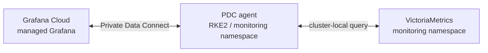

# Grafana PDC (Private Data Connect) Agent

Grafana Labs マネージド Grafana から **宅内 RKE2 の VictoriaMetrics** にアクセスするための
PDC agent。SSH リバーストンネルを確立し、Grafana Cloud がプライベートネットワーク内の
データソースをクエリできるようにする。

## なぜ PDC agent が必要か

VictoriaMetrics は宅内 RKE2 上のプライベートネットワーク (`192.168.0.x`) に存在する。
Grafana Labs マネージド Grafana から直接アクセスできないため、PDC agent が
Grafana Cloud にアウトバウンド接続してリバーストンネルを張る。



宅内にローカル Grafana は不要。Grafana Cloud のダッシュボードから VictoriaMetrics の
メトリクスを直接参照できる。

## 構成

| 項目 | 値 |
|---|---|
| イメージ | `grafana/pdc-agent:latest` |
| Namespace | `monitoring` |
| レプリカ数 | 3 (Grafana Cloud が自動ロードバランス) |
| 接続先 | Grafana Cloud PDC クラスタ |

## セットアップ (初回)

### 1. Grafana Cloud で PDC token を発行する

Grafana Cloud UI → **Connections → Private data source connect → Add new network**

「Configuration details」に表示される以下の値を控える:

| 値 | 説明 |
|---|---|
| Token | `pdc-signing:write` スコープを持つ API トークン |
| Hosted Grafana ID | 数値 (例: `123456`) |
| PDC Cluster | クラスタ識別子文字列 (例: `prod-us-central-0`) |

### 2. BSM にシークレットを登録する

Bitwarden Secrets Manager のプロジェクト `my-infra` に以下を登録:

| BSM シークレット名 | 値 |
|---|---|
| `GRAFANA_PDC_TOKEN` | 手順 1 で取得した Token |
| `GRAFANA_PDC_HOSTED_GRAFANA_ID` | 手順 1 で取得した Hosted Grafana ID |
| `GRAFANA_PDC_CLUSTER` | 手順 1 で取得した PDC Cluster 文字列 |

### 3. ArgoCD が自動的にデプロイする

main ブランチにマージされると ArgoCD が `k8s/pve/pdc-agent/` を同期し、
`grafana-pdc-credentials` Secret が ExternalSecret 経由で作成され、
Deployment が起動する。

### 4. Grafana Cloud でデータソースを追加する

Grafana Cloud UI → **Connections → Data sources → Add data source → Prometheus**

| 設定 | 値 |
|---|---|
| URL | `http://victoria-metrics-victoria-metrics-single-server.monitoring.svc:8428` |
| Private data source connect | 作成した Network を選択 |

## 接続確認

```bash
# Pod が 3 台起動しているか確認
kubectl -n monitoring get pods -l app=pdc-agent

# ログでトンネル接続を確認 ("connected" が表示されれば正常)
kubectl -n monitoring logs -l app=pdc-agent --tail=20

# ExternalSecret の同期状態確認
kubectl -n monitoring get externalsecret grafana-pdc-credentials
```

## レプリカ数について

3 replicas にしている理由:
- Grafana Cloud は接続されている PDC agent にロードバランスを行う
- agent が 1 台障害になっても残り 2 台でトンネルを維持できる
- CPU は OpenSSH の制約で 1 core 以上スケールしないため、横に増やす

## トラブルシューティング

```bash
# agent が Grafana Cloud に接続できない場合
kubectl -n monitoring logs deploy/pdc-agent -f

# Secret が正しく作成されているか確認
kubectl -n monitoring get secret grafana-pdc-credentials -o jsonpath='{.data}' | base64 -d

# Pod を再起動 (token が無効になった場合など)
kubectl -n monitoring rollout restart deploy/pdc-agent
```

Grafana Cloud 側で「Network is offline」と表示される場合は token の期限切れを確認する。
