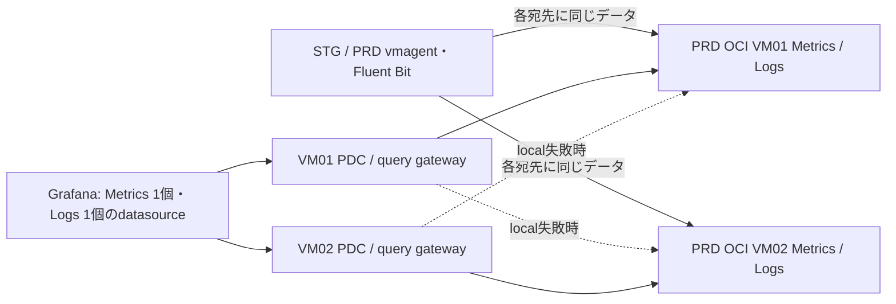

# Re:Venter 監視の移行と運用

2026-10-06、TalosへのGitOps移行とVM側PDCへの切り替えを完了。
PRD OCIの別Fault Domainにある2台へSTG/PRDの監視データを複製する。
既存GrafanaのMetrics / Logs URLとPDC認証は維持する。
利用者が既存URLでのGrafanaアクセスを確認した後、旧保存先・PVC・OCIボリュームを撤去済み。
STGの割当は300GBから200GB、PRDは194GB。旧PDCと旧取り込みPodも撤去した。

既存URL:
- `http://victoria-metrics.reventer-monitoring.svc.cluster.local:8428`
- `http://victoria-logs.reventer-monitoring.svc.cluster.local:9428`

両PDCは同じ既存networkへ接続済み。agentの認証・SSH接続各1本、
名前解決・query gateway経由の実queryを確認。Grafana画面とalertルール自体の
確認は、画面を操作できる利用者の確認結果と区別して記録する。

上図は現在のGrafana経路。ingest endpointはVMごとに分け、
Cloudflare Accessのservice tokenで認証する。共有Tunnelでランダムに片側へ
書き込む構成にはしない。read proxyにはquery APIだけを許可している。

## 検証済み事項

- Talos側の6 ApplicationはSynced / Healthy。旧専用Argo CDは全controllerを
  停止し、旧Applicationの自動同期も無効化。再適用による復活を防ぐ設定を
  Re:Venter側にも保存。Talos ImageUpdaterの実際のGit書き戻しを確認した。
- 元Metricsのスナップショット1,077ファイルは両VMともSHA256一致。
  ARMの元保存先と同じVictoriaMetrics v1.111.0 / VictoriaLogs v1.50.0を使い、
  起動・query・環境ラベル・時刻範囲を検証した。イメージはdigest固定。
- 2026-09-08〜10-06のLogs件数は、PRD 12,166,171 / STG 102,243で元保存先と
  両VMが一致。当日00:00〜05:30もPRD 927 / STG 315で一致。
- 05:20 UTCの時系列数は`up`が22、env別はPRD 19,803 / STG 46で一致。
- 05:30〜05:42 UTCの引き継ぎ区間では、Logsの不足32件を各VMへ追加した。
  Metricsも同区間を補完し、同一時刻の重複を1msで排除する。
- Metrics / Logsを各2並列でqueryしたHTTP rate・users・DAU・Logs countは全件成功。
  SSH接続を含む所要時間は約7.6〜9.1秒。単発の履歴queryは約1〜9秒。
- 片側の保存プロセス停止時、同じ側のquery gatewayからpeerへ切り替わった。
  全監視プロセスとTunnelの停止時も、生存側のqueryは約0.4〜1.8秒で成功。
  停止側への書き込みのみ永続キューへ保持され、Metrics破棄カウンタは0。
  VM01停止中に実際の日次継続率jobも成功した。両側を復帰済み。最終確認で全Metrics queueと全Fluent Bit backlogが0、
  両collectorの破棄カウンタ0、各VMのOOM / restartも0。systemd起動経路を確認。
- 履歴・実ingest・query後のメモリ使用量は約420〜454MB、availableは約341〜381MB。
  PDC起動後、一方のOS更新中の正常側はused約459MB / available約347MB、
  PDC単体は約10MiB。ダッシュボード全体の負荷は画面側でも確認する。
- 認証済みの4 endpointはhealth 200、認証なしは403。管理APIは公開しない。

プロセス/Tunnel停止に加えて、実OS更新とboot交換を伴う復旧を検証した。
PDCの切り替えと、両方向のOS更新時の片側PDC切断・正常側のquery・復帰を確認した。
RPO/RTOをゼロと保証するものではない。

## Grafana切り替え

1. 現在のMetrics/Logs datasource URLとPDC選択を確認する。datasource UIDは
   維持する。標準の`.svc.cluster.local` / `.svc` URLは、各PDC containerの
   `extra_hosts`で同じloopback query gatewayへ解決する。他のURLなら先に
   alias / read route / TLS / PermitRemoteOpenを調整し、実URLで検証する。
2. 全collectorのMetrics pending bytesとFluent Bit backlogが排出され、
   両VMで履歴と新しいデータが読めることを確認する。stale/空のreplicaを
   Grafanaの優先backendへ戻さない。
3. 旧`monitoring/pdc-agent.yaml`をreplicas=0としてGitへ公開し、停止を確認。
   `scripts/deploy-reventer-observability.py --enable-pdc`で2 agentを有効化する。
   同じPDC networkでGrafanaの既存datasource・dashboard・alertを確認する。
4. 実Grafanaから片側停止と復帰を再確認する。停止側の復帰前にqueue/freshnessを
   確認し、必要ならPDCを一時的に除外してcatch-upを待つ。
5. 撤去完了: STG vmagentのqueueを専用hostPathへ移し、旧VictoriaMetricsへの
   必須podAffinityを除去。STG/PRDとも各2つのHA remoteWrite先だけを使う。
   Fluent Bitの旧Loki outputも除去し、retention-jobはvmagentへ一度だけ記録する。
6. 利用者のGrafana切替確認と削除指示を受け、PodによるPVC参照がないこと、
   両VMのSTG/PRD Metrics・Logs canaryと送信queueを確認後、旧Deployment・Service・
   PVC2本を削除。CSIのDelete reclaim policyによってOCIの50GB volume2本も削除済み。
   旧取り込み専用のCloudflare DNS2件・Access application2件・service token・
   Tunnel/configもTerraformで撤去済み（追加0・変更0・削除7）。
   旧保存先へ切り戻す手順は使えない。復旧は生存VMまたは検証済みbackupから行う。

## バックアップ・復元

元保存先を稼働させたまま公式APIでimmutable snapshotを作成し、
`scripts/snapshot-reventer-observability.py --replica 01`（または02）でstagingする。
Metricsは128MBを目安に分割し、SHA256が一致しないファイルだけ再転送する。
スナップショットの大きな一括転送やBusyBox `tail`による大容量再開には依存しない。
スナップショット名はremote `migration/snapshot-metadata.json`に記録する。
全payloadはTLSとSSHで直接送信し、local workspaceにarchiveを書かない。

新VMの停止中に`restore-reventer-observability.py --replica 01`を使う。
checksum、archive path、停止状態を確認し、初期データは`*-bootstrap`へ退避する。
一度復元されたVMにはmarkerが付くため、この初回seed手順を再実行しない。
`verify-reventer-observability.py`と`backfill-reventer-observability.py`は今回の
2026-10-06固定時刻を検証・補完する移行用scriptであり、日常のbackup手順ではない。

VMのdisk消失やqueue上限を超えた長期停止からの復旧では、生存replicaの新しい
snapshotで履歴を再seedする。queueだけでは古い履歴は復元できない。
検証後に今回作成したsnapshotだけを公式delete APIで整理できる。元保存先や
復元済みdata、PVCの削除とは分け、復旧可能なbackupを維持する。

## 容量・認証・監視

- STG割当200GB（100GB boot × 2）、PRD割当194GB（47GB boot × 2 + 50GB boot × 2）。
  両環境ともvolumeは10 VPU/GB、OKEはBasic。PRD volume backupは2個/無料5個枠。
  直近3日間の利用明細でCompute課金は0。公式文書のA1無料条件と既存契約の適用は
  区別し、明細を監視する。共有バックアップのObject Storageリクエスト課金は別途確認。
  OKE node交換・burst・残ったboot volumeも全て集計してから変更する。
- 各VMは1GB RAM / 50GB boot。query concurrency=2とメモリ上限を使い、
  Docker log rotation / swap / security updatesを設定。swapを常用してよい
  設計とはしない。disksの20%以上を空け、query/merge時の余裕を監視する。
- Always Freeのidle reclamationや同一tenancy/ADの障害は、この2 VMの片側障害
  対策だけでは保証できない。人工的な負荷で回収判定を回避せず、状態を監視し
  復旧可能なbackupを持つ。
- Metrics queueは各URL 2GiB。STG/PRDとも専用hostPath `/var/lib/reventer/vmagent` に保持する。
  node disk消失ではqueueも失われるため、失われた期間は生存replicaから復旧する。
  hostPathはPod再起動には残るが、node/disk消失には残らない。
- Logsは各output 256MBのfilesystem queue、無制限retry、jitter付き3〜30秒の
  再試行。deliveryはat least onceであり、再送時に重複logが生じ得る。
  上限を超えると古いデータが捨てられるため、queueとdrop counterを監視する。
- `up{job="oci-monitoring-storage"}`、process memory、free disk、
  `vmagent_remotewrite_pending_data_bytes` / `vmagent_remotewrite_packets_dropped_total`、
  Fluent Bitのstorage/backlog/drop/retry統計を確認する。
  Grafanaのalertルール変更はまだ行っていない。切替時に既存alertも検証する。
- Cloudflare credentialsはHCPの暗号化remote state管理、collector Secretは
  Terraform管理。Access service tokenは1年の有効期間を持つため期限前に更新。
  secretをrotationしたらcollectorを再起動し、VM `.env` / gatewayも再deployする。
  Bitwarden controllerのcredentialを抽出する方法は使わない。
- Bootstrap `user_data`変更はOCIでVM再作成を要求する。既存VMは`prevent_destroy`
  と`ignore_changes`で保護し、Docker Compose v2やbundleの更新はguest内で行う。
  boot volumeの保持も有効。日常の設定更新でVMを作り直さない。

CIのmonitoring overlay対象追加はGitHub OAuthのworkflow scope不足で公開できず、
パッチを`reventer-ci-workflow.patch`に保存した。適用にはworkflow変更権限を持つ
通常の認証を使う。今回のrender、API dry-run、稼働バイナリでの構文検証、実データ
比較、障害試験は実施済み。

## OS更新

日次の順次更新、実収集canary、boot backupによるrollbackは
[os-update/README.md](os-update/README.md)を参照。復旧時の小額の一時課金は
承認済み。実機でOS復旧・履歴補完・両VMの正常更新を検証し、日次timerを有効化済み。
独立したsecurity updateは協調制御へ移し、両VMの同時更新を防ぐ。
