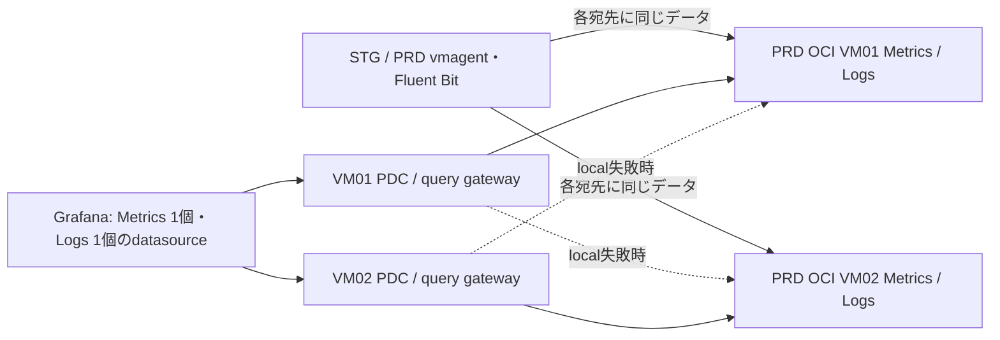

# Re:Venter 監視の移行と運用

2026-10-06、TalosへのGitOps移行とVM側PDCへの切り替えを完了。
2026-10-07の利用者指示により、STGデータはSTG OCIの2台、PRDデータはPRD OCIの2台へ分離する。
各環境は別Fault Domainに複製し、OS更新・rollbackもその環境内のpeerで行う。
以下の2026-10-06検証記録は当時の共有構成を記した履歴であり、現在の配置は末尾を参照。
2026-10-08の指示でPRDのGrafana URLも `-prd` 付きに統一。PDC認証は維持する。旧PRD aliasと接続許可は残さない。
利用者が既存URLでのGrafanaアクセスを確認した後、旧保存先・PVC・OCIボリュームを撤去済み。
STGの割当は300GBから200GB、PRDは194GB。旧PDCと旧取り込みPodも撤去した。

現在のPRD URL:
- `http://victoria-metrics-prd.reventer-monitoring.svc.cluster.local:8428`
- `http://victoria-logs-prd.reventer-monitoring.svc.cluster.local:9428`

両PDCは同じ既存networkへ接続済み。agentの認証・SSH接続各1本、
名前解決・query gateway経由の実queryを確認。Grafana画面とalertルール自体の
確認は、画面を操作できる利用者の確認結果と区別して記録する。

上図は現在のGrafana経路。ingest endpointはVMごとに分け、
Cloudflare Accessのservice tokenで認証する。共有Tunnelでランダムに片側へ
書き込む構成にはしない。read proxyにはquery APIだけを許可している。

## 検証済み事項

- Talos側の6 ApplicationはSynced / Healthy。旧専用Argo CDは全controllerを
  停止し、旧Applicationの自動同期も無効化。再適用による復活を防ぐ設定を
  Re:Venter側にも保存。Talos ImageUpdaterの実際のGit書き戻しを確認した。
- 元Metricsのスナップショット1,077ファイルは両VMともSHA256一致。
  ARMの元保存先と同じVictoriaMetrics v1.111.0 / VictoriaLogs v1.50.0を使い、
  起動・query・環境ラベル・時刻範囲を検証した。イメージはdigest固定。
- 2026-09-08〜10-06のLogs件数は、PRD 12,166,171 / STG 102,243で元保存先と
  両VMが一致。当日00:00〜05:30もPRD 927 / STG 315で一致。
- 05:20 UTCの時系列数は`up`が22、env別はPRD 19,803 / STG 46で一致。
- 05:30〜05:42 UTCの引き継ぎ区間では、Logsの不足32件を各VMへ追加した。
  Metricsも同区間を補完し、同一時刻の重複を1msで排除する。
- Metrics / Logsを各2並列でqueryしたHTTP rate・users・DAU・Logs countは全件成功。
  SSH接続を含む所要時間は約7.6〜9.1秒。単発の履歴queryは約1〜9秒。
- 片側の保存プロセス停止時、同じ側のquery gatewayからpeerへ切り替わった。
  全監視プロセスとTunnelの停止時も、生存側のqueryは約0.4〜1.8秒で成功。
  停止側への書き込みのみ永続キューへ保持され、Metrics破棄カウンタは0。
  VM01停止中に実際の日次継続率jobも成功した。両側を復帰済み。最終確認で全Metrics queueと全Fluent Bit backlogが0、
  両collectorの破棄カウンタ0、各VMのOOM / restartも0。systemd起動経路を確認。
- 履歴・実ingest・query後のメモリ使用量は約420〜454MB、availableは約341〜381MB。
  PDC起動後、一方のOS更新中の正常側はused約459MB / available約347MB、
  PDC単体は約10MiB。ダッシュボード全体の負荷は画面側でも確認する。
- 認証済みの4 endpointはhealth 200、認証なしは403。管理APIは公開しない。

プロセス/Tunnel停止に加えて、実OS更新とboot交換を伴う復旧を検証した。
PDCの切り替えと、両方向のOS更新時の片側PDC切断・正常側のquery・復帰を確認した。
RPO/RTOをゼロと保証するものではない。

## Grafana切り替え

1. 現在のMetrics/Logs datasource URLとPDC選択を確認する。datasource UIDは
   維持する。標準の`.svc.cluster.local` / `.svc` URLは、各PDC containerの
   `extra_hosts`で同じloopback query gatewayへ解決する。他のURLなら先に
   alias / read route / TLS / PermitRemoteOpenを調整し、実URLで検証する。
2. 全collectorのMetrics pending bytesとFluent Bit backlogが排出され、
   両VMで履歴と新しいデータが読めることを確認する。stale/空のreplicaを
   Grafanaの優先backendへ戻さない。
3. 旧`monitoring/pdc-agent.yaml`をreplicas=0としてGitへ公開し、停止を確認。
   `scripts/deploy-reventer-observability.py --enable-pdc`で2 agentを有効化する。
   同じPDC networkでGrafanaの既存datasource・dashboard・alertを確認する。
4. 実Grafanaから片側停止と復帰を再確認する。停止側の復帰前にqueue/freshnessを
   確認し、必要ならPDCを一時的に除外してcatch-upを待つ。
5. 撤去完了: STG vmagentのqueueを専用hostPathへ移し、旧VictoriaMetricsへの
   必須podAffinityを除去。STG/PRDとも各2つのHA remoteWrite先だけを使う。
   Fluent Bitの旧Loki outputも除去し、retention-jobはvmagentへ一度だけ記録する。
6. 利用者のGrafana切替確認と削除指示を受け、PodによるPVC参照がないこと、
   両VMのSTG/PRD Metrics・Logs canaryと送信queueを確認後、旧Deployment・Service・
   PVC2本を削除。CSIのDelete reclaim policyによってOCIの50GB volume2本も削除済み。
   旧取り込み専用のCloudflare DNS2件・Access application2件・service token・
   Tunnel/configもTerraformで撤去済み（追加0・変更0・削除7）。
   旧保存先へ切り戻す手順は使えない。復旧は生存VMまたは検証済みbackupから行う。

## バックアップ・復元

元保存先を稼働させたまま公式APIでimmutable snapshotを作成し、
`scripts/snapshot-reventer-observability.py --replica 01`（または02）でstagingする。
Metricsは128MBを目安に分割し、SHA256が一致しないファイルだけ再転送する。
スナップショットの大きな一括転送やBusyBox `tail`による大容量再開には依存しない。
スナップショット名はremote `migration/snapshot-metadata.json`に記録する。
全payloadはTLSとSSHで直接送信し、local workspaceにarchiveを書かない。

新VMの停止中に`restore-reventer-observability.py --replica 01`を使う。
checksum、archive path、停止状態を確認し、初期データは`*-bootstrap`へ退避する。
一度復元されたVMにはmarkerが付くため、この初回seed手順を再実行しない。
`verify-reventer-observability.py`と`backfill-reventer-observability.py`は今回の
2026-10-06固定時刻を検証・補完する移行用scriptであり、日常のbackup手順ではない。

VMのdisk消失やqueue上限を超えた長期停止からの復旧では、生存replicaの新しい
snapshotで履歴を再seedする。queueだけでは古い履歴は復元できない。
検証後に今回作成したsnapshotだけを公式delete APIで整理できる。元保存先や
復元済みdata、PVCの削除とは分け、復旧可能なbackupを維持する。

## 容量・認証・監視

- STG割当200GB（100GB boot × 2）、PRD割当194GB（47GB boot × 2 + 50GB boot × 2）。
  両環境ともvolumeは10 VPU/GB、OKEはBasic。PRD volume backupは2個/無料5個枠。
  直近3日間の利用明細でCompute課金は0。公式文書のA1無料条件と既存契約の適用は
  区別し、明細を監視する。共有バックアップのObject Storageリクエスト課金は別途確認。
  OKE node交換・burst・残ったboot volumeも全て集計してから変更する。
- 各VMは1GB RAM / 50GB boot。query concurrency=2とメモリ上限を使い、
  Docker log rotation / swap / security updatesを設定。swapを常用してよい
  設計とはしない。disksの20%以上を空け、query/merge時の余裕を監視する。
- Always Freeのidle reclamationや同一tenancy/ADの障害は、この2 VMの片側障害
  対策だけでは保証できない。人工的な負荷で回収判定を回避せず、状態を監視し
  復旧可能なbackupを持つ。
- Metrics queueは各URL 2GiB。STG/PRDとも専用hostPath `/var/lib/reventer/vmagent` に保持する。
  node disk消失ではqueueも失われるため、失われた期間は生存replicaから復旧する。
  hostPathはPod再起動には残るが、node/disk消失には残らない。
- Logsは各output 256MBのfilesystem queue、無制限retry、jitter付き3〜30秒の
  再試行。deliveryはat least onceであり、再送時に重複logが生じ得る。
  上限を超えると古いデータが捨てられるため、queueとdrop counterを監視する。
- `up{job="oci-monitoring-storage"}`、process memory、free disk、
  `vmagent_remotewrite_pending_data_bytes` / `vmagent_remotewrite_packets_dropped_total`、
  Fluent Bitのstorage/backlog/drop/retry統計を確認する。
  Grafanaのalertルール変更はまだ行っていない。切替時に既存alertも検証する。
- Cloudflare credentialsはHCPの暗号化remote state管理、collector Secretは
  Terraform管理。Access service tokenは1年の有効期間を持つため期限前に更新。
  secretをrotationしたらcollectorを再起動し、VM `.env` / gatewayも再deployする。
  Bitwarden controllerのcredentialを抽出する方法は使わない。
- Bootstrap `user_data`変更はOCIでVM再作成を要求する。既存VMは`prevent_destroy`
  と`ignore_changes`で保護し、Docker Compose v2やbundleの更新はguest内で行う。
  boot volumeの保持も有効。日常の設定更新でVMを作り直さない。

CIのmonitoring overlay対象追加はGitHub OAuthのworkflow scope不足で公開できず、
パッチを`reventer-ci-workflow.patch`に保存した。適用にはworkflow変更権限を持つ
通常の認証を使う。今回のrender、API dry-run、稼働バイナリでの構文検証、実データ
比較、障害試験は実施済み。

## OS更新

日次の順次更新、実収集canary、boot backupによるrollbackは
[os-update/README.md](os-update/README.md)を参照。復旧時の小額の一時課金は
承認済み。実機でOS復旧・履歴補完・両VMの正常更新を検証し、日次timerを有効化済み。
独立したsecurity updateは協調制御へ移し、両VMの同時更新を防ぐ。

## STG / PRD分離（2026-10-07）

利用者はGrafana datasourceを環境別にする方針を選択。
STGは `terraform/oci-observability-stg`、PRDは既存 `terraform/oci-observability`。
STG workerの100GB bootを50GBへ1台ずつ置換し、両旧bootのTERMINATEDを確認。
STGはOKE 50GB×2＋監視50GB×2=200GB、PRDは既存194GB。

STG URLs:
- `http://victoria-metrics-stg.reventer-monitoring.svc.cluster.local:8428`
- `http://victoria-logs-stg.reventer-monitoring.svc.cluster.local:9428`

PRDは上記の `-prd` 付き2 URLを使用。各PDCは両環境のaliasを解決し、環境別のquery gatewayを
使用。異なる環境のgatewayはread-only proxyであり、データを保存しない。
STG collectorはper-URL relabelでenv=prd/sharedをPRDへ、STG/未分類のSTGクラスタ
メトリクスをSTGへ送る。STG LogsはSTGにだけ複製する。
新しいSTG Access tokenはPRDとは別。旧STG collector Secretは、STGで収集する
PRD SQL exporter / shared metrics用に引き続き必要。

OS deployには `--environment stg` / `--environment prd`、通常bundleの逐次deployには
`--replica 01` / `--replica 02`を使う。各環境のcanaryのみで更新を判定し、他環境の
正常canaryで更新を許可しない。自動更新の有効化前に両peerの実収集を確認する。

Query gatewayはCloudflareの520〜526/530もpeerへの再試行対象にする。
Tunnelが停止した際のHTTP 530/1033が、1台目で検索を止めないようにする。
上流へのUser-Agentは固定し、Grafanaやローカル確認ツールによる差をなくす。
根拠: [Cloudflare Error 530](https://developers.cloudflare.com/support/troubleshooting/http-status-codes/cloudflare-5xx-errors/error-530/) / [vmauth retry](https://docs.victoriametrics.com/victoriametrics/vmauth/)。

履歴移行はPRD元データを停止整合性のある一時cloneに保持したまま実施。
移行用STG VMだけMetricsを4か月/Logsを33日にし、元保存先に残る月・日partitionの
先頭データが取り込み時の保持期限で捨てられないようにする。恒常VMは3か月/30日のまま。
100日分のMetricsを日ごとに比較し、2,984,306 vectorのlabelとquery timestampが一致。
native再取り込みによる微小な数値丸めは相対1.1e-12・絶対1e-12以内で検証。
Logsは元保存先の116,282件で本文・時刻・stream・重複件数の一致を確認。
公式Metrics snapshotは子snapshotへのsymlinkを展開してコピーし、停止済みLogsとともに
1,906ファイルのSHA256を両STG VMで照合してから1台ずつ切り替える。
切り替え後はpeerからSTGの現在データを補い、実collector canaryの復旧を確認する。

Metrics補完の受信件数は `/metrics` の `vm_rows_inserted_total{type="vmimport"}` で確認。
v1.111.0の内部metricsは1秒cacheされるため、取り込み前後の読取りはcache更新を
待って比較する。JSON exportは5分単位・現在の`env="stg"`・`reduce_mem_usage=1`。
JSONlineには明示的なContent-Typeを付け、Logsはstream labelを維持してmissing分だけ入れる。

障害試験ではSTG 01のstorage停止とOCI VM自体の停止を順に実施し、STG 02の
実collector canaryとPRD側のSTG read-only gatewayで継続参照を確認した。
復旧後に欠けた履歴をpeerから補完し、障害時間帯のLogs 53件の本文・時刻・stream・
重複件数が両STG VMで一致することを確認。稼働containerのmount inodeを照合してから
旧STG seed前データを削除し、両STG VMの日次OS更新timerを再有効化した。

PRDから旧STG Metricsだけを削除するselectorは `env="stg"` と、PRD/sharedを
明示的に除外した旧STG cluster/namespaceを使う。保持期間全体のnative exportで
16-byteの期間headerだけが返ることを確認する（空exportは0 byteではない）。
PRD/sharedの固定日のseries label setと複数月の代表query値が削除前後で一致。
Logsは一時的にloopbackの削除APIを有効にし、`{env="stg"}` streamを削除する。
PRDの前日全Logsの件数・内容hashが一致し、STG streamが0件になった後、削除APIを
無効化する。Metricsの全保持partitionをforce mergeして物理領域を回収し、稼働中の
`data/metrics` / `data/logs`と別の旧`migration` archive / bootstrap dataも削除する。

GrafanaのSTG datasource追加にはGrafana URLとdatasource編集権限を持つサービス
アカウントtokenが必要。PDC tokenやMetrics ingest credentialでは代用できない。
バックエンドの確認と、Grafana UI上の設定完了は別々に記録する。

PRDの混在データを含む旧OS復旧backup 3個は、領域回収済みの各VMを1台ずつ
停止整合性のある状態でsnapshotし、AVAILABLEになったPRD専用backup 2個へ置換した。
新backupからの実boot restoreは今回追加実施していない。既存のPRD実rollback試験と、
STG instance principalによるbackup/restore-volume API検証は成功済み。
両PRD VMの環境専用canaryを確認して日次OS更新timerを再開した。
全4 VMの環境別query gateway / PDC alias、8個の実collector canaryが正常。
両クラスタのMetrics pending queue / dropped packet、Logs retries_failed / dropped_recordsは0。

移行用STG/PRD E4 VMと各50GB bootはTERMINATEDを確認し削除済み。
最終全compartment監査: STG volume合計200GB / backup 0、PRD 194GB / backup 2。
各アカウントの恒常監視VMはE2 Micro 2台、OKEはA1 2台で合計4 OCPU / 24GB。
全volumeは10 VPU/GB、OKEはBasic。移行中の少額の一時課金と過去の超過分は
消えないため、これからの恒常構成の無料枠内確認と過去の請求を区別する。

## PRD URL統一（2026-10-08）

PRD用PDC aliasとPermitRemoteOpenを `victoria-metrics-prd` / `victoria-logs-prd`
へ置換し、旧PRD名の互換設定は廃止。全4 VMで新alias・許可設定・旧alias不在と
PRDの実collector canary queryを確認。Grafana datasource URLの編集は未実施。

作業時、STG 02の全storage/query/tunnelが停止していたことを検出。
STG更新journalは2026-10-07T19:33:58Zから blocked / recovery-failed / target=02。
更新markerはsucceeded、recovery volumeは未作成で、peer maintenance SSHは正常。
更新処理が実行中でないことを確認し、全composeサービスを起動してboot activationも
再有効化。停止期間のMetricsはcollector disk queueから再送されていることを確認。
STG 01は正常。自動更新journalのblocked解除は原因・履歴補完の検証前に行わない。

## STG更新停止の調査・対処（2026-10-09）

元の更新は2026-10-07T19:03:54Zに開始、package更新が19:19:30Zに成功して
19:19:54Zにboot。制御journalは19:33:58Zにblocked / recovery-failedとなった。
元コードはreadinessの例外と復旧失敗の詳細を記録しておらず、最初の再起動判定
タイムアウトの直接原因は旧記録だけでは断定できない。監査の全関連compartmentに
対応するrestore API失敗イベントは見つからず、現在のinstance principalで同じ
restore-volume作成APIは成功。診断用未接続50GB volumeは削除済み。

停止期間のSTG Logs 7,437件の本文・時刻・stream・重複件数が両VMで一致し、
複数時刻の代表Metricsも一致。両クラスタのMetrics pending queue / dropped packets、
Logs retries_failed / dropped_recordsは0（過去のretry回数は別）。

制御下でSTG02の正常OS更新・再起動・履歴parity・PDC復帰を確認。その後、
STG02を実際にboot backupからvolume交換して復元し、実collector canaryと
履歴parityを検証。元の未接続50GB bootと不要な旧事故backupは削除済み。

通常systemd serviceでSTG02からSTG01の更新を試したところ、2026-10-09T07:28:37Zに
OCI 409 Conflict、診断journalの保存でも429 TooManyRequestsを再現した。
更新記録のCASを最新ETag / ownerを確認しながら再試行し、書込みのburstを抑える修正と、
復旧失敗時にboot未交換ならstorageを再開する修正を適用。readiness・更新・復旧の
失敗記録はprovider payloadを含めず保存する。関連41テスト成功。

修正後の同じsystemd serviceは2026-10-09T07:37:02Zに開始、STG01のOS更新・
再起動・履歴parity・PDC復帰を完了して07:51:36Zに正常終了した。
全4 VMのjournalはidle、kernelは6.8.0-1062-oracle、全8 collector canaryがfresh。
再試験後の両クラスタの送信待ち / dropped packet / retries_failed / dropped_recordsは0。
全compartment監査でSTG 200GB / backup 2、PRD 194GB / backup 3。
全volumeは10 VPU/GB、一時VM / 未接続の復旧用volumeは残っていない。
PRDの3 backupは5個の無料枠内であり、通常のverified backup整理に従う。

STG両timerはenabled / activeに再開、PRD両timerもactive。全4 journalはidle。

## 2026-10-10: STG / PRDの容量統一

PRDの既存OKE worker boot volume 2台をオンラインで47GBから50GBへ拡張。
両アカウントともOKE 50GB×2＋監視50GB×2＝200GB、全volumeは10 VPU/GB。
上記の194GBは変更前の監査記録。新規VMや追加volumeは作成しない。
