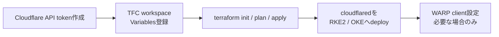

# terraform/cloudflare

Cloudflare の DNS・Tunnel・Zero Trust Access を Terraform で管理する workspace。
ここで扱う到達経路は、自分だけが Cloudflare Access 経由で利用するための私用入口です。
0.0.0.0/0 に向けた入口として扱わない。

WARP (クライアント設定) は Terraform スコープ外。本 README の末尾に手順を記載する。

---

## 構成リソース

| ファイル | リソース |
|---|---|
| `tunnels.tf` | `cloudflare_zero_trust_tunnel_cloudflared` × 2 + config |
| `dns.tf` | `cloudflare_record` (CNAME, proxied) |
| `access.tf` | `cloudflare_zero_trust_access_application` + policy |
| `locals.tf` | Cloudflare Access 経由の到達先定義マップ |

### トンネル構成

| トンネル名 | 用途 | cloudflared の配置先 |
|---|---|---|
| `rke2-home-managed-by-tf` | Cloudflare Access 経由で宅内 RKE2 / LAN 管理UIへ到達する | RKE2 上の `cloudflared` Pod |
| `oke-cloud-managed-by-tf` | Cloudflare Access 経由で OKE 内の管理用到達先へ接続する | OKE 上の `cloudflared` Pod |

### Cloudflare Access 経由の到達先

| ホスト名 | トンネル | バックエンド | Access |
|---|---|---|---|
| `argocd-rke2.miutaku.work` | rke2 | `http://argocd-server.argocd.svc.cluster.local:80` | 必須 |
| `argocd-oke.miutaku.work` | oke | `http://argocd-server.argocd.svc.cluster.local:80` | 必須 |
| `wol.miutaku.work` | rke2 | `http://gptwol-service.app-gptwol.svc.cluster.local:5000` | 必須 |
| `unifi.miutaku.work` | rke2 | `https://192.168.0.132:11443` | 必須 |
| `wifi-ap.miutaku.work` | rke2 | `https://192.168.0.253` | 必須 |
| `ix2215.miutaku.work` | rke2 | `http://192.168.10.254` | 必須 |
| `nas-01.miutaku.work` | rke2 | `https://192.168.20.191` | 必須 |
| `nas-02.miutaku.work` | rke2 | `https://192.168.20.192` | 必須 |
| `pve-x570.miutaku.work` | rke2 | `https://192.168.0.115:8006` | 必須 |
| `pve-b550m.miutaku.work` | rke2 | `https://192.168.0.119:8006` | 必須 |
| `nanokvm-1.miutaku.work` | rke2 | `http://192.168.10.240` | 必須 |
| `nanokvm-2.miutaku.work` | rke2 | `http://192.168.10.241` | 必須 |

---

## 前提条件

### Cloudflare 側

- Cloudflare アカウントに対象ドメインが登録済み (Zone が存在すること)
- API トークンを以下の権限で作成済み:
  - `Zone:DNS:Edit`
  - `Zero Trust:Edit` (Access Application + Tunnel 作成に必要)

**API トークン作成手順:**  
`https://dash.cloudflare.com/profile/api-tokens` → `Create Token` → `Custom token`

### TFC 側

TFC workspace `cloudflare` に以下の Variables を登録する。

| Variable | Sensitive | 値の取得方法 |
|---|---|---|
| `cloudflare_api_token` | **yes** | Cloudflare → API Tokens |
| `account_id` | no | Cloudflare ダッシュボード右サイドバー |
| `zone_id` | no | Cloudflare → 対象ドメイン → Overview の右サイドバー |
| `domain` | no | `miutaku.work` |
| `tunnel_secret_rke2` | **yes** | `openssl rand -base64 32` の出力 |
| `tunnel_secret_oke` | **yes** | `openssl rand -base64 32` の出力 |
| `access_allowed_emails` | no | JSON 配列形式: `["user@example.com"]` |

> **tunnel_secret について**: 32 バイトをそのまま base64 エンコードした文字列を設定する。  
> `openssl rand -base64 32` は 32 バイトの乱数を生成するので、この出力をそのまま使う。

---

## 全体の流れ



---

## セットアップ

### terraform init

```bash
cd terraform/cloudflare
terraform login  # TFC トークンを対話入力 (初回のみ)
terraform init
```

### plan / apply

```bash
terraform fmt
terraform validate
terraform plan
terraform apply
```

---

## 到達先の追加方法

`locals.tf` の `rke2_services` または `oke_services` にエントリを追加する。

```hcl
# 例: RKE2 に Grafana を追加する場合
rke2_services = {
  argocd = { ... }  # 既存

  grafana = {
    backend       = "http://kube-prometheus-stack-grafana.monitoring.svc.cluster.local:80"
    no_tls_verify = false
  }
}
```

Access 保護が必要な場合は `access_protected_subdomains` にキーを追加する。

```hcl
access_protected_subdomains = toset(["argocd", "grafana"])
```

追加後 `terraform apply` を実行すると、DNS レコードとトンネル設定が自動更新される。

---

## apply 後の確認

```bash
# Cloudflare ダッシュボードで確認
# Zero Trust → Networks → Tunnels → "rke2-home-managed-by-tf" / "oke-cloud-managed-by-tf" が存在すること
# DNS → locals.tf の rke2_services / oke_services に対応する CNAME (proxied) が存在すること
# Zero Trust → Access → Applications → access_protected_subdomains に対応する application が存在すること
```

cloudflared が deploy されるまでトンネルは `INACTIVE` 状態になる。  
RKE2・OKE ともに ArgoCD で `cloudflared` を deploy した後に `HEALTHY` に変わる。

### cloudflared の tunnel 認証情報取得

cloudflared を k8s に deploy する際に tunnel の認証情報が必要になる。apply 後に TFC の出力から取得する。

```bash
# tunnel ID の確認 (TFC outputs に追加すると便利)
terraform output  # または TFC UI から確認
```

現在の k8s manifest は tunnel token を ExternalSecret 経由で注入する。RKE2 側は
`k8s/pve/argocd/README.md`、OKE 側は `k8s/oci/argocd/README.md` を参照。

---

## トラブルシューティング

### トンネルが INACTIVE のまま

cloudflared が deploy されていないか、`tunnel_secret` が一致していない場合に発生する。

1. `kubectl get pods -n cloudflared` でコンテナが起動しているか確認
2. `kubectl logs -n cloudflared <pod>` でエラーを確認
3. `tunnel_secret` が `openssl rand -base64 32` の形式であることを確認 (44 文字)

### Access Application にアクセスできない

`access_allowed_emails` に正しいメールアドレスが含まれているか確認する。  
TFC の Variable は JSON 配列形式で設定する: `["user@example.com", "other@example.com"]`

### DNS レコードが反映されない

CNAME の `proxied = true` のため、実際の tunnel IP は隠蔽される。  
`dig argocd-rke2.miutaku.work` で Cloudflare の Anycast IP が返れば正常。

---

## WARP クライアント設定 (Terraform スコープ外)

WARP は Cloudflare Zero Trust の VPN クライアント。これを使うと Cloudflare Access で保護した私用の到達先へ透過的にアクセスできる。Terraform では管理せず、以下の手順で手動設定する。

### 1. Zero Trust 組織の設定

`https://one.dash.cloudflare.com` → `Settings` → `Custom Pages` で組織名 (team name) を設定する。  
例: `my-infra` → WARP 接続先は `my-infra.cloudflareaccess.com`

### 2. Device Enrollment Policy の設定

`Zero Trust` → `Settings` → `WARP Client` → `Device enrollment permissions`  
→ `Add a rule` → `Emails` → 自分のメールアドレスを追加

### 3. WARP クライアントのインストールと接続

```bash
# macOS
brew install --cask cloudflare-warp

# 接続
warp-cli teams-enroll my-infra   # 組織名を指定
warp-cli connect
warp-cli status
```

Windows / iOS / Android は Cloudflare の公式ページからインストール:  
`https://developers.cloudflare.com/cloudflare-one/connections/connect-devices/warp/download-warp/`

### 4. Split Tunnel の設定 (任意)

宅内 LAN (`192.168.0.0/24`) をトンネル経由にしない場合:  
`Zero Trust` → `Settings` → `WARP Client` → `Split Tunnels` → `Exclude IPs` に `192.168.0.0/24` を追加
