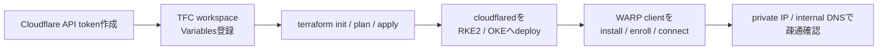

# terraform/cloudflare

Cloudflare の DNS・Tunnel・Zero Trust Access・Tunnel private routes・WARP client profile を Terraform で管理する workspace。
ここで扱う到達経路は、自分だけが Cloudflare Access / WARP 経由で利用するための私用入口です。
0.0.0.0/0 に向けた入口として扱わない。

公開ホスト名で扱いやすい HTTP/HTTPS 管理 UI は Cloudflare Access protected application として出す。
任意ポート・複数プロトコルが発生する宅内通信は、Tailscale subnet router と同じ粒度で Cloudflare Tunnel private routes に寄せる。

Tailscale subnet router は全経路移行が終わるまで emergency access として残す。

---

## 構成リソース

| ファイル | リソース |
|---|---|
| `tunnels.tf` | `cloudflare_zero_trust_tunnel_cloudflared` × 2 + published app ingress + private CIDR routes |
| `warp.tf` | default WARP client profile + Split Tunnel include + Local Domain Fallback + Gateway proxy |
| `dns.tf` | published app 用 `cloudflare_record` (CNAME, proxied) |
| `access.tf` | published app 用 `cloudflare_zero_trust_access_application` + policy |
| `locals.tf` | published app、private route、internal DNS suffix の定義マップ |

### トンネル構成

| トンネル名 | 用途 | cloudflared の配置先 |
|---|---|---|
| `rke2-home-managed-by-tf` | 宅内 RKE2 / LAN 管理 UI と private network routes | RKE2 上の `cloudflared` Pod |
| `oke-cloud-managed-by-tf` | OKE 内の管理用 published apps | OKE 上の `cloudflared` Pod |

### Cloudflare Access 経由の HTTP/HTTPS 到達先

| ホスト名 | トンネル | バックエンド | Access |
|---|---|---|---|
| `argocd-rke2.miutaku.work` | rke2 | `http://argocd-server.argocd.svc.cluster.local:80` | 必須 |
| `argocd-oke.miutaku.work` | oke | `http://argocd-server.argocd.svc.cluster.local:80` | 必須 |
| `wol.miutaku.work` | rke2 | `http://gptwol-service.app-gptwol.svc.cluster.local:5000` | 必須 |
| `unifi.miutaku.work` | rke2 | `https://192.168.0.132:11443` | 必須 |
| `wifi-ap.miutaku.work` | rke2 | `https://192.168.0.253` | 必須 |
| `ix2215.miutaku.work` | rke2 | `http://192.168.10.254` | 必須 |
| `nas-01.miutaku.work` | rke2 | `https://192.168.20.191` | 必須 |
| `nas-02.miutaku.work` | rke2 | `https://192.168.20.192` | 必須 |
| `pve-x570.miutaku.work` | rke2 | `https://192.168.0.115:8006` | 必須 |
| `pve-b550m.miutaku.work` | rke2 | `https://192.168.0.119:8006` | 必須 |
| `nanokvm-1.miutaku.work` | rke2 | `http://192.168.10.240` | 必須 |
| `nanokvm-2.miutaku.work` | rke2 | `http://192.168.10.241` | 必須 |

### WARP 経由の private routes

| CIDR | 用途 | トンネル |
|---|---|---|
| `192.168.0.0/24` | native VLAN | rke2 |
| `192.168.10.0/24` | 管理 VLAN | rke2 |
| `192.168.20.0/24` | サーバ VLAN | rke2 |
| `192.168.30.0/24` | クライアント VLAN | rke2 |
| `192.168.40.0/24` | IoT VLAN | rke2 |

この private route は DNS レコードを作らない。
WARP client profile は Split Tunnel include mode でこれらの CIDR と必要な Zero Trust hostnames を WARP に入れる。
WARP 接続済み端末から `192.168.x.x` 宛の TCP / UDP 通信を Cloudflare Tunnel 経由で宅内へ届ける。

### Terraform 管理の WARP / Gateway 設定

| リソース | 内容 |
|---|---|
| `cloudflare_zero_trust_device_profiles.default_warp` | default WARP client profile を `warp` mode で管理 |
| `cloudflare_zero_trust_split_tunnel.default_warp_include` | `rke2_private_routes` の CIDR と Zero Trust / Access hostnames を include mode で WARP へ入れる |
| `cloudflare_zero_trust_local_fallback_domain.default_warp` | `miutaku.internal` を CoreDNS (`192.168.20.201`) へ向ける |
| `cloudflare_zero_trust_gateway_settings.account` | Gateway proxy の TCP / UDP を有効化、TLS decrypt は無効 |

---

## 前提条件

### Cloudflare 側

- Cloudflare アカウントに対象ドメインが登録済み (Zone が存在すること)
- API トークンを以下の権限で作成済み:
  - `Zone:DNS:Edit`
  - `Zero Trust:Edit` (Access Application + Tunnel + Tunnel route + WARP / Gateway 設定に必要)

**API トークン作成手順:**  
`https://dash.cloudflare.com/profile/api-tokens` → `Create Token` → `Custom token`

### TFC 側

TFC workspace `cloudflare` に以下の Variables を登録する。
既定値があるものは必要な場合だけ上書きする。

| Variable | Sensitive | 値の取得方法 |
|---|---|---|
| `cloudflare_api_token` | **yes** | Cloudflare → API Tokens |
| `account_id` | no | Cloudflare ダッシュボード右サイドバー |
| `zone_id` | no | Cloudflare → 対象ドメイン → Overview の右サイドバー |
| `domain` | no | `miutaku.work` |
| `zero_trust_team_name` | no | WARP enrollment に使う team name。既定値は `my-infra` |
| `warp_split_tunnel_include_hosts` | no | 外部 IdP など追加で WARP に入れる hostname map。通常は未設定でよい |
| `tunnel_secret_rke2` | **yes** | `openssl rand -base64 32` の出力 |
| `tunnel_secret_oke` | **yes** | `openssl rand -base64 32` の出力 |
| `access_allowed_emails` | no | JSON 配列形式: `["user@example.com"]` |

> **tunnel_secret について**: 32 バイトをそのまま base64 エンコードした文字列を設定する。  
> `openssl rand -base64 32` は 32 バイトの乱数を生成するので、この出力をそのまま使う。

---

## 全体の流れ



---

## セットアップ

### terraform init

```bash
cd terraform/cloudflare
terraform login  # TFC トークンを対話入力 (初回のみ)
terraform init
```

### plan / apply

```bash
terraform fmt
terraform validate
terraform plan
terraform apply
```

---

## 到達先の追加方法

### HTTP/HTTPS published app

`locals.tf` の `rke2_services` または `oke_services` にエントリを追加する。

```hcl
# 例: RKE2 に Grafana を追加する場合
rke2_services = {
  argocd = { ... }  # 既存

  grafana = {
    backend       = "http://kube-prometheus-stack-grafana.monitoring.svc.cluster.local:80"
    no_tls_verify = false
  }
}
```

Access 保護が必要な場合は `access_protected_subdomains` にキーを追加する。

```hcl
access_protected_subdomains = toset(["argocd", "grafana"])
```

追加後 `terraform apply` を実行すると、DNS レコード・Access application・トンネル ingress が自動更新される。
`access_protected_subdomains` に入れた hostname は、WARP Split Tunnel include hosts にも自動で入る。

### Private network route

ポート単位で公開したくない通信は `rke2_private_routes` に CIDR を追加する。
WARP 端末から対象 CIDR へ直接到達できるようになる。

```hcl
rke2_private_routes = {
  example_vlan = {
    network = "192.168.50.0/24"
    comment = "home example VLAN via rke2 tunnel"
  }
}
```

同じ Cloudflare アカウント内で重複する CIDR を扱う場合は Virtual Network の設計が必要。
現状の宅内 VLAN は重複していないため default virtual network を使う。

---

## apply 後の確認

```bash
# Cloudflare dashboard
# Zero Trust → Networks → Tunnels → "rke2-home-managed-by-tf" / "oke-cloud-managed-by-tf" が存在すること
# Zero Trust → Networks → Routes → rke2_private_routes の CIDR が tunnel route として存在すること
# DNS → locals.tf の rke2_services / oke_services に対応する CNAME (proxied) が存在すること
# Zero Trust → Access → Applications → access_protected_subdomains に対応する application が存在すること
```

cloudflared が deploy されるまでトンネルは `INACTIVE` 状態になる。  
RKE2・OKE ともに ArgoCD で `cloudflared` を deploy した後に `HEALTHY` に変わる。

### cloudflared の tunnel 認証情報取得

cloudflared を k8s に deploy する際に tunnel の認証情報が必要になる。apply 後に TFC の出力から取得する。

```bash
# tunnel ID の確認 (TFC outputs に追加すると便利)
terraform output  # または TFC UI から確認
```

現在の k8s manifest は tunnel token を ExternalSecret 経由で注入する。RKE2 側は
`k8s/pve/argocd/README.md`、OKE 側は `k8s/oci/argocd/README.md` を参照。

---

## WARP private network access

Tailscale subnet router の置き換え対象はこの経路。
`ssh` / `kubectl` / `NFS` / `HTTP` / `Proxmox API` / `UPS/NUT` など、ポートごとの published app にしない通信は WARP 経由で private IP へ直接接続する。

接続例:

```bash
ssh root@192.168.0.115
ssh miutaku@192.168.20.126
curl -k https://192.168.20.250:8007
showmount -e 192.168.20.192
upsc ups-a@192.168.10.112
```

### WARP client

```bash
# macOS
brew install --cask cloudflare-warp

warp-cli teams-enroll my-infra
warp-cli connect
warp-cli status
```

Windows / iOS / Android は Cloudflare の公式ページからインストール:
`https://developers.cloudflare.com/cloudflare-one/connections/connect-devices/warp/download-warp/`

### Terraform 管理の Zero Trust 設定

WARP client profile、Split Tunnel、Gateway proxy、Local Domain Fallback は `warp.tf` で Terraform 管理する。
`terraform apply` 後、WARP client を enroll して接続すれば private routes が使える。

管理内容:

- WARP client profile は default profile として `service_mode_v2_mode = "warp"` を設定する
- Split Tunnel は include mode にして、`rke2_private_routes` の CIDR と Zero Trust / Access hostnames を WARP 経由にする
- Gateway proxy は TCP / UDP を有効化し、TLS decrypt と root CA 配布は無効化する
- `miutaku.internal` は Local Domain Fallback で CoreDNS (`192.168.20.201`) に向ける
- client の mode 切替は無効化しつつ、organization からの離脱と client switch はロックしない

`zero_trust_team_name` から `<team>.cloudflareaccess.com` を include hosts に入れる。
Google / GitHub / Okta など外部 IdP で認証する場合は、必要な IdP hostname を `warp_split_tunnel_include_hosts` に追加する。

WARP client の install / enroll / connect は端末側の作業として残る。
Device enrollment permissions は provider v4 の Terraform resource に露出していないため、必要なら Cloudflare dashboard 側で許可する。

### Tailscale からの移行順

1. `terraform apply` で private routes と WARP client profile を作る。
2. WARP client を install / enroll / connect する。
3. `ssh root@192.168.0.115`、`curl -k https://192.168.20.250:8007`、`dig @192.168.20.201 pve-x570.miutaku.internal` などで疎通確認する。
4. Ansible や手順書は private IP または `*.miutaku.internal` のまま使う。
5. 数日運用してから Tailscale subnet router を emergency access だけに縮退する。

---

## トラブルシューティング

### トンネルが INACTIVE のまま

cloudflared が deploy されていないか、`tunnel_secret` が一致していない場合に発生する。

1. `kubectl get pods -n cloudflared` でコンテナが起動しているか確認
2. `kubectl logs -n cloudflared <pod>` でエラーを確認
3. `tunnel_secret` が `openssl rand -base64 32` の形式であることを確認 (44 文字)

### Published app にアクセスできない

`access_allowed_emails` に正しいメールアドレスが含まれているか確認する。  
TFC の Variable は JSON 配列形式で設定する: `["user@example.com", "other@example.com"]`

### DNS レコードが反映されない

CNAME の `proxied = true` のため、実際の tunnel IP は隠蔽される。  
`dig argocd-rke2.miutaku.work` で Cloudflare の Anycast IP が返れば正常。

### Private IP に到達できない

1. Cloudflare dashboard の `Networks → Routes` で対象 CIDR が `rke2-home-managed-by-tf` に紐づいているか確認する
2. WARP client が対象 Zero Trust organization に enroll され、Traffic and DNS mode で接続しているか確認する
3. `cloudflare_zero_trust_split_tunnel.default_warp_include` に対象 CIDR が含まれているか確認する
4. Gateway proxy で TCP / UDP が有効か確認する
5. RKE2 上の `cloudflared` Pod から対象 IP に到達できるか確認する

### `*.miutaku.internal` が解決できない

WARP 接続中の DNS は Gateway 側で解決される。
`miutaku.internal` は `cloudflare_zero_trust_local_fallback_domain.default_warp` で CoreDNS (`192.168.20.201`) へ向ける。
