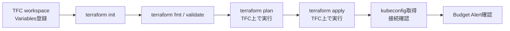

# terraform/oci

OCI Always Free 上に OKE Basic クラスタを構築する Terraform workspace。

対象リソース: VCN、サブネット、IGW、NAT GW、Security List、OKE クラスタ (Basic)、ノードプール (A1.Flex × 1)、Budget Alert。

**Always Free 制限** — 絶対に超えない:

| リソース | 上限 | 本 workspace での使用量 |
|---|---|---|
| A1.Flex OCPU | 4 OCPU | 2 OCPU/node × 1 node = 2 OCPU |
| A1.Flex メモリ | 24 GB | 12 GB/node × 1 node = 12 GB |
| Block Volume | 200 GB / 2 vol | Longhorn で管理 |
| Flex LB | 10 Mbps 固定 | ingress-nginx の Service annotation で指定 |

> **重要**: OKE クラスタタイプは `BASIC_CLUSTER` に固定。`ENHANCED_CLUSTER` は $0.10/h の課金が発生する。

---

## 前提条件

### OCI 側

- OCI アカウント (PAYG 昇格済み、または Always Free 確認済み)
  - Always Free の A1.Flex は PAYG 昇格後に取得できるリージョンがある。未昇格の場合は ap-tokyo-1 で試し、取得できなければ ap-osaka-1 / ap-seoul-1 / ap-singapore-1 でリトライ
- API キーが作成済みで `~/.oci/config` に設定済み
- コンパートメントが作成済み

### Terraform Cloud (TFC)

- `app.terraform.io` のアカウントと `miutaku` organization が存在すること
- workspace `my-infra` が作成済みで、以下の Terraform Variables が登録済みであること

| Variable | sensitive | 値 |
|---|---|---|
| `tenancy_ocid` | no | OCI コンソール → Profile → Tenancy |
| `compartment_ocid` | no | OCI コンソール → Identity → Compartments |
| `user_ocid` | no | OCI コンソール → Profile → User Settings |
| `fingerprint` | no | OCI コンソール → Profile → API Keys |
| `private_key_base64` | **yes** | `base64 -w0 ~/.oci/oci_api_key.pem` の出力 |
| `ssh_public_key` | **yes** | ノードへの SSH 公開鍵 (`cat ~/.ssh/id_rsa.pub`) |
| `alert_email` | no | Budget Alert 通知先メールアドレス |

---

## 全体の流れ



---

## セットアップ

### ローカル CLI のインストール

```bash
# OCI CLI (pip でユーザーインストール)
pip3 install --user --break-system-packages oci-cli

# PATH に追加 (pip --user でインストールした場合)
echo 'export PATH="$HOME/.local/bin:$PATH"' >> ~/.bashrc
source ~/.bashrc
oci --version

# pip がシステム Python を使えない場合 (virtualenv 環境など)
# → virtualenv 内にインストールして ~/bin にシンボリックリンク
pip3 install oci-cli   # virtualenv 内でインストール
mkdir -p ~/bin
ln -sf "$(which oci)" ~/bin/oci
echo 'export PATH="$HOME/bin:$PATH"' >> ~/.bashrc
source ~/.bashrc

# kubectl
sudo snap install kubectl --classic

# ArgoCD CLI (オプション)
curl -sSL -o ~/bin/argocd https://github.com/argoproj/argo-cd/releases/latest/download/argocd-linux-amd64
chmod +x ~/bin/argocd && argocd version --client

# terraform (1.9+ 推奨)
# https://developer.hashicorp.com/terraform/install
```

### OCI API Key の設定

```bash
mkdir -p ~/.oci

# 秘密鍵を生成 (新規の場合)
openssl genrsa -out ~/.oci/oci_api_key.pem 2048
chmod 600 ~/.oci/oci_api_key.pem

# OCI に登録する公開鍵を出力 (DER 形式で fingerprint 計算)
openssl rsa -pubout -in ~/.oci/oci_api_key.pem 2>/dev/null

# fingerprint 確認 (OCI Console の表示と一致するはず)
# 注: OCI は DER 形式の MD5 を使う。PEM 形式では一致しないので注意
openssl rsa -pubout -outform DER -in ~/.oci/oci_api_key.pem 2>/dev/null | openssl md5 -c
```

OCI コンソール → **User Settings → API Keys → Add API Key → Paste Public Key** で公開鍵を登録する。
API Key は 1 ユーザーにつき最大 3 つまで。上限に達している場合は不要なものを削除してから追加する。

```bash
# ~/.oci/config を作成
cat > ~/.oci/config <<EOF
[DEFAULT]
user=<user_ocid>
fingerprint=<fingerprint>
tenancy=<tenancy_ocid>
region=ap-tokyo-1
key_file=/home/<username>/.oci/oci_api_key.pem
EOF
chmod 600 ~/.oci/config

# 接続確認
export SUPPRESS_LABEL_WARNING=True
oci iam region list --output table
```

> **重要**: `key_file` には `~` ではなく絶対パスを使うこと。`~` が展開されずに認証エラーになる場合がある。

### terraform init

```bash
cd terraform/oci
terraform login  # TFC トークンを対話入力 (初回のみ)
terraform init
```

### plan / apply

```bash
terraform fmt
terraform validate
terraform plan   # TFC 上で実行される
terraform apply
```

> `terraform apply` は TFC の Speculative Plan → Apply flow を経る。  
> TFC の UI (`app.terraform.io`) で Confirm & Apply する。

---

## apply 後の作業

### kubeconfig 取得

```bash
# TFC の output から取得
terraform output -raw kubeconfig > ~/.kube/oke-config
export KUBECONFIG=~/.kube/oke-config
kubectl get nodes
```

または OCI CLI で取得:
```bash
oci ce cluster create-kubeconfig \
  --cluster-id $(terraform output -raw cluster_id) \
  --file ~/.kube/oke-config \
  --region ap-tokyo-1 \
  --token-version 2.0.0 \
  --kube-endpoint PUBLIC_ENDPOINT
export KUBECONFIG=~/.kube/oke-config
kubectl get nodes
```

期待される出力:
```
NAME        STATUS   ROLES    AGE   VERSION
10.0.1.x    Ready    <none>   Xm    v1.31.1
10.0.1.y    Ready    <none>   Xm    v1.31.1
```

### Flex LB の帯域幅制限

Always Free の Flex LB は 10 Mbps 固定。ingress-nginx の Service に以下の annotation を付与する:

```yaml
service.beta.kubernetes.io/oci-load-balancer-shape: "flexible"
service.beta.kubernetes.io/oci-load-balancer-shape-flex-min: "10"
service.beta.kubernetes.io/oci-load-balancer-shape-flex-max: "10"
```

### Budget Alert 確認

1. OCI コンソール → `Billing & Cost Management` → `Budgets` で `always-free-budget` が表示されることを確認
2. Alert Rule に `alert_email` が登録されていることを確認
3. 1% ($0.01) を超えた時点でメールが届く

---

## トラブルシューティング

### A1.Flex の capacity 不足

OCI では A1.Flex の Always Free インスタンスは需要が高く、リージョンによっては取得できない場合がある (`Out of host capacity` エラー)。

対処:
```hcl
# variables.tf の region を変更して再 apply
variable "region" {
  default = "ap-osaka-1"  # または ap-seoul-1 / ap-singapore-1
}
```

TFC の Variable `region` をコンソールから上書きする方法でも対応可能。

### ノードが `NotReady` のまま

OKE ノードが `NotReady` の場合、ノードの cloud-init ログを確認:

```bash
# ノードの IP を特定
kubectl get nodes -o wide

# OCI コンソール → Compute → Instances で対象インスタンスを選択
# → Console Connection で cloud-init ログを確認
oci compute instance get --instance-id <instance-ocid>
```

### terraform apply でタイムアウト

OKE クラスタの作成には 10〜20 分かかる。TFC のデフォルトタイムアウト (1h) 以内に完了するはずだが、ノードプールのプロビジョニングが長引く場合は TFC の Apply ログを確認する。

### BASIC_CLUSTER への変更が必要になった場合

既存クラスタが `ENHANCED_CLUSTER` として作成されてしまった場合、`type` の変更は in-place では不可。`terraform destroy` → `terraform apply` でクラスタを再作成する。
