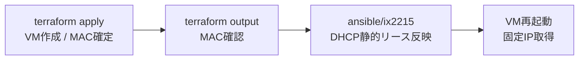
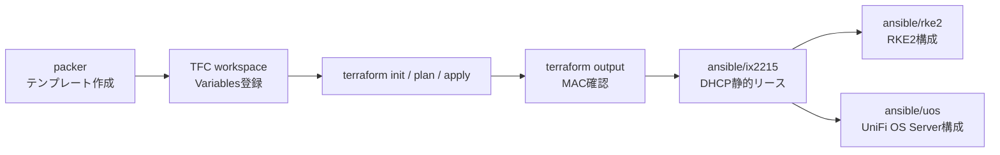

# terraform/pve

Proxmox VE 2 ノードクラスタ (`pve-x570` / `pve-b550m`) に VM を作成する Terraform workspace。  
TFC workspace: `pve-home` (organization: `miutaku`)

## 作成される VM

| モジュール | 台数 | 役割 | ノード配置 |
|---|---|---|---|
| `rke2_lb` | 2 | HAProxy + Keepalived (RKE2 LB) | 両ノード分散 |
| `rke2_server` | 3 | RKE2 コントロールプレーン (etcd) | 両ノード分散 |
| `rke2_worker` | 2 | RKE2 ワーカー | 両ノード分散 |
| `prd_rec_server` | 1 | 録画サーバー (pve-x570, PCI passthrough) | pve-x570 固定 |
| `dev_rec_server` | 1 | 開発用録画サーバー (USB passthrough) | pve-b550m 固定 |
| `dev_application_server` | 1 | 開発用アプリサーバー | pve-b550m 固定 |
| `truenas` | 2 | TrueNAS Scale NAS | 両ノード分散 |
| `unifi_os_server` | 1 | UniFi OS Server 専用 VM | pve-x570 固定 |
| `magic_mirror_server` | 1 | MagicMirror² サーバー (VLAN 40 / USB passthrough) | pve-b550m 固定 |

Ubuntu VM は `template-ubuntu-26-04-home-amd64`、TrueNAS VM は `template-truenas-scale-home-amd64`
から clone して作成する。テンプレートは事前に `packer/` 配下の手順でビルドしておく必要がある。

## DHCP と IP アドレスの関係

VM は DHCP で IP を取得する (cloud-init による静的 IP 設定はしない)。  
以下の流れで IP を固定する:



`variables.tf` の `rke2_lb_ips` / `rke2_server_ips` / `rke2_worker_ips` には  
DHCP 静的リースで割り当てる予定の IP を設定する。これらは Ansible inventory 生成に使われる。

## Ansible inventory の自動生成

`terraform apply` 後、`ansible.tf` が以下のファイルを自動生成する:

| 生成先ファイル | 内容 |
|---|---|
| `ansible/rke2/hosts/prd` | RKE2 Ansible インベントリ (INI 形式) |
| `ansible/rke2/group_vars/prd-all.yml` | LB VIP・HAProxy サーバー一覧 |

生成後は GitHub Actions が変更を自動コミット (`chore(ansible): auto-update RKE2 inventory from terraform output`)。  
**これらのファイルは直接編集しないこと。**

## 前提条件

### Proxmox 側

- 2 ノード Proxmox VE クラスタが構築済み (`pve-x570`, `pve-b550m`)
- 各ノードに Proxmox API トークンが作成済み

**API トークン作成手順** (各 PVE ノードの Web UI で実施):
1. `Datacenter` → `Permissions` → `API Tokens` → `Add`
2. User: `root@pam` / Token ID: `terraform` / Privilege Separation: **無効**
3. Secret を控えておく (一度しか表示されない)

- `template-ubuntu-26-04-home-amd64` テンプレートが両ノードに存在すること  
  → 存在しない場合は `packer/ubuntu-26-04/` を参照してビルドする

### TFC 側

TFC workspace `pve-home` に以下の Variables を登録する。

| Variable | Sensitive | 値 |
|---|---|---|
| `pm_api_token_id` | **yes** | `root@pam!terraform` (ノード名は省略) |
| `pm_api_token_secret` | **yes** | API トークン Secret |

> MAC アドレス・VM 台数・IP アドレスは `variables.tf` のデフォルト値を使用。  
> 変更が必要な場合は `variables.tf` を直接編集してコミットする。

## 全体の流れ



## セットアップ

```bash
cd terraform/pve
terraform login  # TFC トークンを対話入力 (初回のみ)
terraform init
```

## plan / apply

```bash
terraform fmt
terraform validate
terraform plan
terraform apply
```

> `terraform apply` は TFC 上で実行される。TFC UI で `Confirm & Apply` する。

## apply 後: MAC アドレスの確認

```bash
terraform output -json rke2_lb_mac_addresses
terraform output -json rke2_server_mac_addresses
terraform output -json rke2_worker_mac_addresses
terraform output -json unifi_os_server_mac_addresses
```

出力された MAC アドレスを `ansible/ix2215/group_vars/all.yml` の
`ix_dhcp_profiles[].fixed_assignments` に記載する。

## VM を追加・変更したいとき

1. `variables.tf` で VM 台数や MAC アドレスを変更する
2. `main.tf` でモジュール設定を変更する
3. `terraform plan` で差分を確認してから `terraform apply`

新しい VM 用の DHCP 静的リースも `ansible/ix2215/group_vars/all.yml` に追加すること。

## トラブルシューティング

### テンプレートが見つからない

```
Error: ... clone: template "template-ubuntu-26-04-home-amd64" not found
```

`packer/ubuntu-26-04/` の手順でテンプレートをビルドする。  
テンプレートは両 Proxmox ノードに存在する必要がある (片方だけでは分散配置時にエラー)。

### VM が起動しない / IP が取得できない

1. `ansible/ix2215/` の DHCP 静的リースが正しく設定されているか確認
2. IX2215 コンソールで `show ip dhcp binding` を実行してリースが有効か確認
3. PVE Web UI でコンソール接続し、DHCP リクエストのログを確認

### PCI passthrough エラー (prd_rec_server)

録画サーバーは `pve-x570` に固定で PCI デバイス (PT3 チューナー) をパススルーしている。  
PCI passthrough には IOMMU の設定が必要。設定済みでない場合は `pve-x570` の BIOS で  
VT-d または AMD-V + IOMMU を有効にし、カーネルパラメータを設定する。
